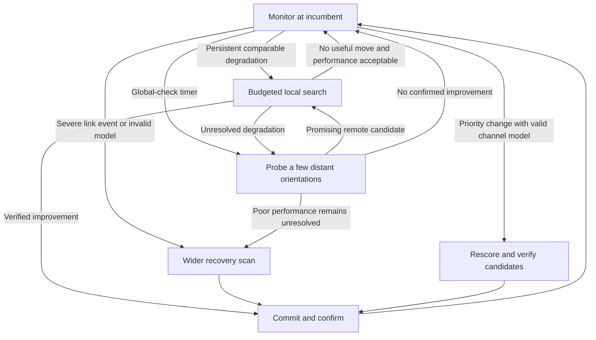
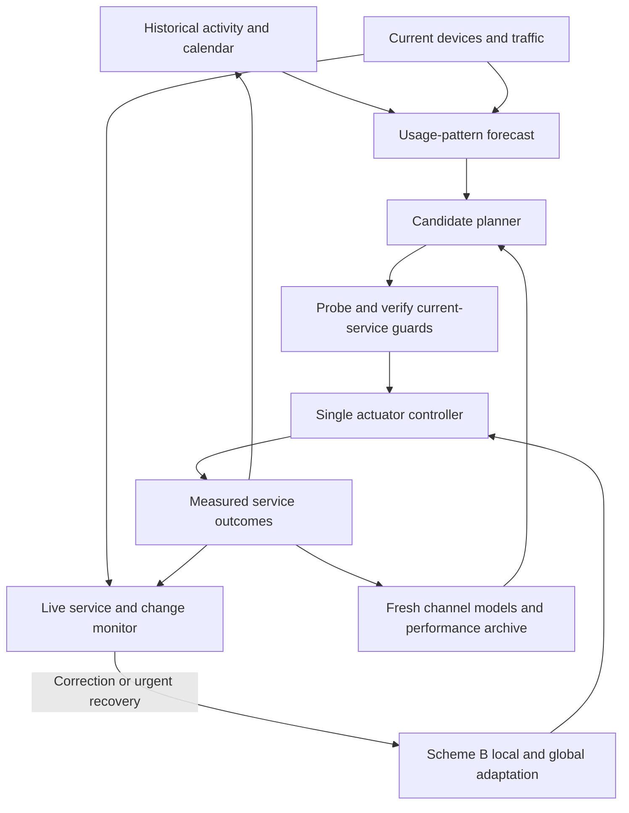

**Angle-of-Arrival Estimation with a**
**Mechanically Rotating Single Wi-Fi Antenna**

*AoA Estimation, Optimal Orientation Selection, and Continuous Adaptation*

This document is organized into three parts:

1. [Part I: AoA Estimation with MUSIC, ESPRIT, and SAGE](#part-i-aoa-estimation-with-music-esprit-and-sage) develops the signal models and three estimators for 1-D and 2-D rotation.
2. [Part II: Finding the Optimal Antenna Orientation](#part-ii-finding-the-optimal-antenna-orientation) uses MUSIC/SAGE channel estimates to optimize one source, aggregate multi-source goodput, or prioritized services.
3. [Part III: Continuous Orientation Optimization in Changing Environments](#part-iii-continuous-orientation-optimization-in-changing-environments) develops periodic rescanning, event-triggered adaptation, and [learning-assisted predictive adaptation](#17-scheme-c-learning-assisted-predictive-adaptation) based on recurring household usage.

Numbered sections run continuously across the three parts so that existing section references remain valid.

---

# Part I: AoA Estimation with MUSIC, ESPRIT, and SAGE

## 1. Purpose and Scope

Part I formulates, from first principles, how a single Wi-Fi antenna that is mechanically rotated about a fixed base can be used to estimate the angle of arrival (AoA) of one or more incoming signals, and then derives three classical estimators — MUSIC, ESPRIT, and SAGE — for two rotation geometries:

- **Scenario A — 1 rotational degree of freedom (DoF):** the antenna is pinned at its base and tilts in a single vertical plane, stepping 5° from 0° to 180° (horizontal on one side, up through vertical, to horizontal on the other side).
- **Scenario B — 2 rotational DoF (pan-tilt gimbal):** the antenna can be tilted to any elevation and, at that tilt, panned in azimuth, so its boresight can point anywhere on the upper hemisphere. The base is the rotation origin.

The physical idea in both cases is the same: mechanical rotation turns one antenna, sampled sequentially over time, into a synthetic array. Part I first builds the shared signal model and states the core measurement challenges (the "problem construction"), then treats each scenario in turn. Assumptions: a common consumer Wi-Fi element with a dipole-like (omni-in-azimuth, toroidal / donut-shaped) radiation pattern; an OFDM Wi-Fi waveform (2.4 / 5 / 6 GHz) that exposes per-subcarrier channel state information (CSI); and quasi-static geometry during one sweep.

## 2. Shared Signal and Geometry Model

### 2.1 Antenna pattern and phase center

Let the antenna body frame have its axis along $\hat z_{\text{body}}$. A typical half-wave dipole has the (magnitude) field pattern

$$
F(\chi) = \left| \frac{\cos\!\left(\frac{\pi}{2}\cos\chi\right)}{\sin\chi} \right|
$$

where $\chi$ is the angle between the antenna axis and the incoming direction. $F(\chi)$ is maximum broadside ($\chi = 90^\circ$) and has deep nulls along the axis ($\chi = 0^\circ, 180^\circ$). Two features of the element matter for AoA: (i) its *directional gain* $g(\chi) = F(\chi)\cdot e^{j\Phi(\chi)}$ modulates the received amplitude as the antenna rotates, and (ii) its *phase center* sits a distance $\rho$ from the base along the antenna axis, so rotation physically displaces the phase center and creates path-length (phase) differences. The amplitude cue dominates when $\rho \ll \lambda$; the phase (synthetic-aperture) cue grows as $\rho$ approaches $\lambda$. For a quarter/half-wave element at 2.4 GHz ($\lambda \approx 12.5$ cm) the arc radius $\rho$ is a fraction of $\lambda$, so a good estimator should exploit amplitude and phase jointly.

### 2.2 Received-signal model

Index the rotation positions by $k = 1,\dots,K$ (orientation $\Omega_k$), OFDM subcarriers by $n = 1,\dots,L$ (wavelength $\lambda_n$), and repeated sweeps / symbols by $t = 1,\dots,M$. After removing the known pilot/preamble symbol $s[n,t]$ (WiFi LTF), the measured complex CSI sample for a single far-field path from direction $\mathbf u(\theta,\phi)$ is

$$
x_k[n,t] = g\big(\chi_k(\theta,\phi)\big) \cdot \exp\!\left(j\frac{2\pi}{\lambda_n}\,\mathbf p_k^{\mathsf T}\mathbf u(\theta,\phi)\right) \cdot \gamma + w_k[n,t]
$$

where $\mathbf p_k$ is the phase-center position at orientation $\Omega_k$, $\gamma$ the complex path gain, and $w$ white noise. Stacking the $K$ positions into one synthetic snapshot $\mathbf x = [x_1,\dots,x_K]^{\mathsf T}$ and allowing $D$ superimposed paths (line-of-sight plus reflections) gives the array model

$$
\mathbf x = \sum_{d=1}^{D} \gamma_d \, \mathbf a(\theta_d,\phi_d) + \mathbf w = \mathbf A\boldsymbol\gamma + \mathbf w
$$

with steering vector $\mathbf a(\theta,\phi) = [a_1,\dots,a_K]^{\mathsf T}$, $a_k(\theta,\phi) = g(\chi_k)\cdot \exp\!\left(j\frac{2\pi}{\lambda}\mathbf p_k^{\mathsf T}\mathbf u\right)$, manifold matrix $\mathbf A = [\mathbf a(\theta_1,\phi_1),\dots,\mathbf a(\theta_D,\phi_D)]$, and gain vector $\boldsymbol\gamma$. This $\mathbf A\boldsymbol\gamma + \mathbf w$ form is exactly the classical array-processing model — MUSIC, ESPRIT, and SAGE all operate on it — except that here the "array" is synthesised by one moving element and the manifold $\mathbf a(\cdot)$ carries the real antenna pattern $g$, not just an ideal phase term.

### 2.3 Problem construction — the four challenges unique to a rotating single antenna

1. **Sequential (non-simultaneous) sampling.** The $K$ synthetic elements are visited one at a time, not captured in one snapshot. Treating them as a single vector $\mathbf x$ requires the channel and source to stay coherent across the whole sweep (quasi-static assumption). Sweep-time budget therefore trades against Doppler/scene motion.
2. **Phase-coherence / reference.** Combining positions by phase demands a common phase reference across the sweep; otherwise transmitter phase, CFO and SFO drift corrupt $\mathbf p_k^{\mathsf T}\mathbf u$. Practical fixes: keep a second fixed reference antenna receiving simultaneously and use the ratio $x_k / x_{\text{ref}}$; or exploit the repeated WiFi LTF pilots to track and remove residual phase. Without a reference, fall back to amplitude-only ($|x_k|$) processing — lower resolution but robust.
3. **Coherent multipath.** Indoor reflections are fully correlated with the LoS path, which rank-deficits the covariance and breaks subspace methods. Remedies: spatial smoothing / forward-backward averaging (in phase-mode / beamspace for the circular manifold), or use SAGE, which is a parametric maximum-likelihood method that handles coherent paths natively.
4. **Pattern and phase-center calibration.** The estimators need an accurate measured $g(\chi)$ and $\rho$. Manufacturing spread, the radome, and near-field coupling to the AP chassis distort the pattern, so a per-unit calibration table (or an on-line self-calibration term) is required.

## 3. Scenario A — Single-Axis (1-DoF) Planar Rotation

### 3.1 Geometry and rotation model

Place the base at the origin $O$ and let the antenna tilt in the $x$–$z$ (vertical) plane about the $\hat y$ axis. With step $\Delta = 5^\circ$ and $k = 0,\dots,36$ ($K = 37$ positions):

$$
\beta_k = k\cdot\Delta,\quad \Delta = 5^\circ,\quad k = 0,\dots,36 \quad\big(\beta \in [0^\circ,180^\circ]\big)
$$

antenna axis:

$$
\hat{\mathbf d}(\beta) = (\cos\beta,\ 0,\ \sin\beta)
$$

phase center:

$$
\mathbf p_k = \rho \cdot \hat{\mathbf d}(\beta_k)
$$

A source lying in the scan plane has direction $\mathbf u(\psi) = (\cos\psi, 0, \sin\psi)$, where $\psi \in [0^\circ,180^\circ]$ is the in-plane arrival angle to be estimated. The angle between the antenna axis and the source is simply $\chi_k = \beta_k - \psi$, so both the pattern and the phase term depend only on the difference $(\beta_k - \psi)$:

$$
a_k(\psi) = F(\beta_k - \psi) \cdot \exp\!\left(j\frac{2\pi\rho}{\lambda}\cos(\beta_k-\psi)\right)
$$

This is a circular-array manifold. Its key structural property: the response as a function of orientation is a fixed "template" $F(\cdot)\cdot\exp\!\left(j\frac{2\pi\rho}{\lambda}\cos(\cdot)\right)$ that is simply *shifted* by the unknown AoA $\psi$. For a single source, AoA estimation is therefore matched filtering — correlate the measured curve against the template and read off the shift. MUSIC/ESPRIT/SAGE generalise this to multiple superimposed paths.

**Note — dimensionality.** *One rotation axis resolves only the arrival angle projected into the scan plane; an out-of-plane source appears at its projected angle. Full 2-D AoA (azimuth + elevation) requires the 2-axis system of Section 4.*

**Note — sampling.** *To avoid spatial aliasing on the synthetic arc, the inter-step arc length must satisfy $\rho\cdot\Delta_{\text{rad}} \le \lambda/2$, i.e. $\rho \le \dfrac{\lambda}{2\times 0.087} \approx 5.7\lambda$ for $\Delta = 5^\circ$. For a physical element $\rho \ll \lambda$ this is amply satisfied; 5° in fact oversamples, giving margin to average or to coarsen the sweep.*

### 3.2 Building snapshots and the covariance

Subspace methods need a covariance estimate of full signal rank. Because one sweep yields a single synthetic vector $\mathbf x$, obtain multiple snapshots by (i) repeating the sweep $M$ times, (ii) using the $L$ OFDM subcarriers as frequency snapshots (recomputing $\mathbf a(\psi)$ per $\lambda_n$, or applying wideband focusing matrices), and (iii) forward–backward / phase-mode spatial smoothing to decorrelate coherent multipath:

$$
\hat{\mathbf R} = \frac{1}{M L}\sum_{m,n} \mathbf x[m,n]\,\mathbf x[m,n]^{\mathsf H} \in \mathbb{C}^{K\times K}
$$

### 3.3 MUSIC

Eigendecompose the covariance and split into signal ($D$ largest eigenvalues) and noise subspaces:

$$
\hat{\mathbf R} = \mathbf U_s \boldsymbol\Lambda_s \mathbf U_s^{\mathsf H} + \mathbf U_n \boldsymbol\Lambda_n \mathbf U_n^{\mathsf H}
$$

The AoA estimates are the peaks of the 1-D MUSIC pseudo-spectrum over $\psi \in [0^\circ,180^\circ]$ (a 37-point grid or finer):

$$
P_{\text{MUSIC}}(\psi) = \frac{1}{\mathbf a(\psi)^{\mathsf H}\, \mathbf U_n \mathbf U_n^{\mathsf H}\, \mathbf a(\psi)} \quad\longrightarrow\quad \hat\psi = \arg\max_{\psi} P_{\text{MUSIC}}(\psi)
$$

Because the manifold $\mathbf a(\psi)$ embeds the true antenna pattern, MUSIC here automatically fuses the amplitude (pattern) and phase (aperture) cues. The number of resolvable paths is limited by $K$ and by how well multipath has been decorrelated.

### 3.4 ESPRIT

ESPRIT needs a shift-invariant (Vandermonde) manifold, which a circular arc does not have directly. The standard route is a **phase-mode / beamspace transform** (the Davies transformation used in UCA-ESPRIT): a DFT across the uniform 5° samples maps the circular manifold, whose modes are weighted by Bessel functions $J_m(2\pi\rho/\lambda)$, onto a virtual uniform linear array with entries $e^{jm\psi}$:

$$
\mathbf T^{\mathsf H} \mathbf a(\psi) \approx \operatorname{diag}\{J_m(2\pi\rho/\lambda)\} \cdot \left[e^{-jM\psi}, \dots, e^{+jM\psi}\right]^{\mathsf T}
$$

On the transformed manifold the usual rotational-invariance step applies. With selection matrices $\mathbf J_1, \mathbf J_2$ picking overlapping mode subsets and the transformed signal subspace $\mathbf E_s$:

$$
\mathbf J_1 \mathbf E_s \boldsymbol\Psi = \mathbf J_2 \mathbf E_s \quad\Longrightarrow\quad \boldsymbol\Psi = (\mathbf J_1\mathbf E_s)^{+}(\mathbf J_2\mathbf E_s)
$$

$$
\operatorname{eig}(\boldsymbol\Psi) = e^{j\psi_d} \quad\Longrightarrow\quad \hat\psi_d = \arg\big(\operatorname{eig}\big)
$$

ESPRIT gives the AoAs in closed form (no spectral search), at the cost of the beamspace approximation and sensitivity to the accuracy of $\rho$ and of the uniform-angular-sampling assumption.

### 3.5 SAGE

SAGE (Space-Alternating Generalized Expectation-maximization) is a maximum-likelihood estimator that fits the $D$ paths one at a time and is the most natural fit for a rotating single antenna: it works with few (even one) snapshots, tolerates coherent multipath, uses the measured pattern $g$ directly (no idealised manifold), and jointly estimates amplitude and angle. Model the $K$ measurements as

$$
\mathbf x = \sum_{d=1}^{D} \gamma_d \cdot \mathbf a(\psi_d) + \mathbf w, \qquad \mathbf w \sim \mathcal{CN}(0, \sigma^2\mathbf I)
$$

SAGE decomposes the observation into per-path "admissible hidden data" and alternates:

1. Initialise $(\psi_d, \gamma_d)$ for $d = 1,\dots,D$ by successive interference cancellation using the beamformer / MUSIC peak.
2. **E-step:** form the complete data for path $d$ by adding back its share of the residual —

   $$
   \hat{\mathbf y}_d = \mathbf x - \sum_{d'\neq d} \gamma_{d'}\, \mathbf a(\psi_{d'})
   $$
3. **M-step (angle):**

   $$
   \hat\psi_d = \arg\max_{\psi} \frac{\left|\mathbf a(\psi)^{\mathsf H}\hat{\mathbf y}_d\right|^2}{\|\mathbf a(\psi)\|^2}
   $$

   — a cheap 1-D search over the scan range.
4. **M-step (gain):**

   $$
   \hat\gamma_d = \frac{\mathbf a(\hat\psi_d)^{\mathsf H}\hat{\mathbf y}_d}{\|\mathbf a(\hat\psi_d)\|^2}
   $$
5. Cycle over $d = 1,\dots,D$ until the log-likelihood converges; optionally add delay $\tau_d$ (from OFDM subcarrier phase slope) and Doppler $\nu_d$ for moving clients, giving joint angle-delay-Doppler estimates.

Because SAGE evaluates the exact pattern-plus-phase manifold, it degrades gracefully when the aperture is tiny (falls back to pattern/amplitude information) and when only magnitudes are trustworthy (magnitude-only likelihood).

## 4. Scenario B — Two-Axis (Pan–Tilt) Rotation

### 4.1 Completing the spatial rotation model

Give the base a 2-axis gimbal: a tilt (elevation) $\alpha$ about $\hat y$ and a pan (azimuth) $\gamma$ about $\hat z$. Using the intrinsic rotation $\mathbf R(\gamma,\alpha) = \mathbf R_z(\gamma)\cdot \mathbf R_y(\alpha)$ applied to the body axis $\hat z_{\text{body}}$, the boresight and phase-center trace a sphere of radius $\rho$:

$$
\hat{\mathbf b}(\gamma,\alpha) = \mathbf R_z(\gamma)\,\mathbf R_y(\alpha)\,\hat{\mathbf z} = (\sin\alpha\cos\gamma,\ \sin\alpha\sin\gamma,\ \cos\alpha)
$$

$$
\mathbf p(\gamma,\alpha) = \rho \cdot \hat{\mathbf b}(\gamma,\alpha)
$$

Parameterise the unknown source direction by elevation $\theta$ and azimuth $\phi$:

$$
\mathbf u(\theta,\phi) = (\sin\theta\cos\phi,\ \sin\theta\sin\phi,\ \cos\theta)
$$

The angle between boresight and source, and hence the full 2-D steering manifold over the two control angles, is

$$
\chi(\gamma,\alpha;\theta,\phi) = \arccos\!\left(\hat{\mathbf b}(\gamma,\alpha)^{\mathsf T}\mathbf u(\theta,\phi)\right)
$$

$$
a(\theta,\phi;\gamma,\alpha) = g(\chi) \cdot \exp\!\left(j\frac{2\pi}{\lambda}\rho\,\hat{\mathbf b}(\gamma,\alpha)^{\mathsf T}\mathbf u(\theta,\phi)\right)
$$

As in Scenario A the response depends on the mismatch between where the antenna points and where the source is (through $\chi$ and through $\hat{\mathbf b}^{\mathsf T}\mathbf u = \cos\chi$), so for a single source it is again a 2-D template-matching / peak-finding problem; for multipath it is the full 2-D array model. Practical modelling points: use intrinsic Euler angles and restrict $\alpha \in [0^\circ,90^\circ]$, $\gamma \in [0^\circ,360^\circ)$ to cover the upper hemisphere while avoiding gimbal-lock degeneracy near $\alpha = 0^\circ$ (where $\gamma$ is unobservable); and pre-compute a calibrated $a(\theta,\phi;\gamma,\alpha)$ lookup because the two-axis pattern is not separable in general.

### 4.2 Sampling the sphere

A comprehensive raster over $(\gamma,\alpha)$ should keep neighbouring pointings within roughly half the element beamwidth (and satisfy the $\rho\cdot\Delta \le \lambda/2$ arc-sampling rule per axis) so that no lobe of the pattern is skipped. An equal-area or spiral spherical grid gives more uniform angular coverage than a naïve lat/long raster, which oversamples near the pole ($\alpha \approx 0^\circ$).

### 4.3 Two operating modes: fast few-measurement search vs. comprehensive scan

The 2-axis freedom creates a genuine choice between finding one dominant source as fast as possible and mapping the whole angular field.

#### (a) Fast AoA from one / a few measurements — active pointing

For a single strong client (e.g., a latency-sensitive LoS device) a full raster is wasteful. Because the received power $P(\gamma,\alpha)$ is a smooth unimodal-ish function of pointing near the source, the antenna can climb to the source in a handful of steps:

1. **Sequential lobing / gradient ascent:** from the current pointing, probe a few offsets ($\pm\delta$ in $\gamma$ and in $\alpha$), estimate the local gradient of $P$ by finite differences, and step toward increasing power; repeat with shrinking $\delta$ (coarse-to-fine). This is the single-antenna analogue of monopulse (true monopulse needs simultaneous sum/difference beams, which one element cannot form).
2. **Null-based refinement:** a dipole's pattern null is far sharper than its broad peak, so once near the source, rotate to place a pattern null on it and use the null depth for a high-precision angle — sharper than peak-seeking.
3. **Bayesian active sensing:** maintain a posterior $p(\theta,\phi \mid \text{measurements})$ and choose the next orientation that maximises expected information gain (minimises posterior entropy) — an information-optimal few-shot search; Thompson sampling is a lightweight approximation.

With a directional element these methods localise a dominant source in on the order of 5–15 measurements instead of a full ~hundreds-point raster. The trade-off: they assume a single dominant path and can be misled by strong reflections, so they suit tracking a known client, not discovering the environment.

#### (b) Comprehensive scan — full spatial sensing

Rastering the whole $(\gamma,\alpha)$ grid and applying a subspace / ML estimator yields the complete angular power (and phase) map: all significant paths, their AoAs and relative strengths, and therefore the dominant reflectors and the multipath geometry of the room. This is what feeds multi-client optimisation and environment characterisation. It costs more sweep time and assumes the scene is static for the duration.

**Guidance.** *Use fast active pointing to acquire/track a single high-priority client or to re-lock after a small move; use a comprehensive scan (periodically or on trigger) to build the multi-path spatial map used for multi-client orientation optimisation and for detecting new reflectors.*

### 4.4 MUSIC, ESPRIT, and SAGE in 2-D

**MUSIC (2-D):** build $\hat{\mathbf R}$ over the sampled orientations (plus subcarrier/sweep snapshots), and search the pseudo-spectrum over the $(\theta,\phi)$ grid:

$$
P_{\text{MUSIC}}(\theta,\phi) = \frac{1}{\mathbf a(\theta,\phi)^{\mathsf H} \mathbf U_n \mathbf U_n^{\mathsf H} \mathbf a(\theta,\phi)}
$$

**ESPRIT (2-D):** decompose the spherical manifold into spherical-harmonic / phase modes (a 2-D beamspace transform), which yields two shift-invariant structures — one per angular coordinate — so that Unitary / EB-ESPRIT returns azimuth and elevation in closed form with automatic pairing. Fast, but relies on the harmonic approximation and accurate calibration.

**SAGE (2-D, recommended):** the same per-path coordinate-ascent as §3.5, now maximising over the pair $(\theta_d, \phi_d)$, and optionally over delay $\tau_d$ (OFDM) and Doppler $\nu_d$. SAGE remains the workhorse for the rotating-antenna problem: it copes with the irregular spherical sampling, coherent multipath, few snapshots, and the real (non-separable, calibrated) 2-axis pattern, and it produces the parametric path list that both operating modes above can consume.

## 5. Practical Wi-Fi Implementation Notes

- **CSI as free snapshots.** Each WiFi packet's LTF gives CSI on $L$ subcarriers; across a 20/40/80/160 MHz channel these act as frequency snapshots and also let SAGE estimate path delay from the phase-vs-subcarrier slope.
- **Reference antenna.** A second, fixed antenna receiving the same packet provides the phase reference that makes cross-position phase meaningful; process $x_k / x_{\text{ref}}$.
- **Sweep timing.** Budget the mechanical settle-plus-measure time per step against channel coherence; for moving people include Doppler in SAGE or shorten/interleave the sweep.
- **Calibration.** Store a measured $g(\chi)$ (and $\rho$, and the 2-axis pattern for Scenario B) per antenna; re-estimate a residual complex calibration term on-line from a known-direction anchor if available.
- **Fallback.** If phase coherence cannot be guaranteed, run amplitude-only pattern-matching (or magnitude-domain SAGE): coarser, but requires no reference and no phase tracking.

## 6. Estimator Comparison

| **Method** | **Principle**               | **Snapshots**                   | **Coherent MP** | **Output**                                   | **Best use here**                                          |
| ---------------- | --------------------------------- | ------------------------------------- | --------------------- | -------------------------------------------------- | ---------------------------------------------------------------- |
| **MUSIC**  | Noise-subspace spectral search    | Needs many ($\hat{\mathbf R}$ rank) | Needs smoothing/FBA   | Pseudo-spectrum peaks                              | Visualising the angular map; multi-path survey                   |
| **ESPRIT** | Rotational invariance (beamspace) | Moderate                              | Needs smoothing       | Closed-form angles                                 | Fast closed-form angle read-out after beamspace transform        |
| **SAGE**   | Per-path maximum likelihood (EM)  | Few / even one                        | Handled natively      | Parametric path list (angle, gain, delay, Doppler) | Primary estimator: irregular sampling, real pattern, coherent MP |

## 7. Notation

| **Symbol**                                                                                                               | **Meaning**                                              |
| ------------------------------------------------------------------------------------------------------------------------------ | -------------------------------------------------------------- |
| $k, K$                                      | rotation-position index / total positions (Scenario A:$K = 37$ at 5° steps) |                                                                |
| $\beta_k$                                                                                                                    | single-axis tilt angle (Scenario A)                            |
| $\gamma, \alpha$                                                                                                             | pan (azimuth) and tilt (elevation) control angles (Scenario B) |
| $\theta, \phi\ /\ \psi$                                                                                                      | source elevation & azimuth (2-D) / in-plane AoA (1-D)          |
| $\mathbf u(\theta,\phi)$                                                                                                     | unit vector toward the source                                  |
| $\hat{\mathbf b}, \hat{\mathbf d}$                                                                                           | antenna boresight / axis direction                             |
| $\rho$                                                                                                                       | phase-center offset from base (arc radius)                     |
| $\lambda, \lambda_n$                        | wavelength / subcarrier$n$ wavelength                                        |                                                                |
| $g(\chi), F(\chi)$                          | complex element gain / dipole magnitude pattern;$\chi$ = angle to source     |                                                                |
| $\mathbf a(\cdot)$                                                                                                           | synthetic-array steering vector (pattern × phase)             |
| $\gamma_d, D$                               | complex gain of path$d$ / number of paths                                    |                                                                |
| $\hat{\mathbf R}, \mathbf U_s, \mathbf U_n$                                                                                  | sample covariance; signal / noise subspace                     |
| $M, L$                                                                                                                       | repeated sweeps / OFDM subcarriers (snapshot sources)          |

---

# Part II: Finding the Optimal Antenna Orientation

## 8. From AoA Estimation to Antenna Orientation Optimization

Part II extends AoA estimation into a control problem: estimate channels with MUSIC or SAGE, predict performance at candidate antenna orientations, and select and verify the best orientation. Section 9 treats **1-D mechanical rotation** first; Section 10 then treats **2-D mechanical rotation**. Each considers (1) one source, (2) multiple sources with an aggregate-throughput objective, and (3) multiple sources carrying services with different priorities.

These are proposed system models and algorithm designs, rather than claims of measured performance. MUSIC and SAGE estimate propagation parameters; a separate optimization stage chooses the antenna orientation. Part II focuses on MUSIC and SAGE; ESPRIT is covered in Part I.

### 8.1 Definitions, geometry conventions, and assumptions

- **Controlled device:** one Wi-Fi receiver, such as an AP, with one mechanically movable antenna and one data-reception RF chain. The baseline optimizes uplink reception from associated clients. Downlink use requires corresponding link measurements and calibration; uplink goodput is not automatically a downlink prediction.
- **Source versus path:** $i=1,\ldots,N$ indexes transmitters/links; $d=1,\ldots,D_i$ indexes paths of transmitter $i$. Several AoA peaks can be reflections of one source and belong to one channel.
- **Service:** $f=1,\ldots,F_s$ indexes a logical flow or service; $i(f)$ identifies its transmitter. Several services from the same client generally share its spatial channel.
- **Control:** $q=\beta$ in 1-D and $q=(\gamma,\alpha)$ in 2-D. One common orientation is held during each data interval. One movable antenna cannot independently orient toward every service or create several simultaneous receive beams.
- **Access model:** clients are sounded using identifiable training packets and normally occupy separate transmission opportunities in this baseline. Interference represents external or overlapping transmissions, not automatically every other associated client. Simultaneous MU-MIMO/OFDMA operation requires a resource-specific model beyond this baseline.
- **Time scale:** geometry and relative path coefficients remain stable over a scan, validation probes, and the intended holding interval. Traffic demand, weights, and the airtime policy are frozen for one optimization epoch and updated between epochs.
- **Calibration:** correct receiver gain changes, packet timing offsets, and phase drift across orientations. A fixed reference must be stable and nonzero, and its frequency response must be accounted for when estimating delays and absolute received power. An arbitrary CSI ratio is not itself an absolute channel calibration.

**Angle convention.** In the equations of Section 4, $\alpha$ and $\theta$ are mathematically *polar angles from $+z$*, despite their earlier elevation labels. Elevation above the horizontal is $90^\circ-\alpha$ or $90^\circ-\theta$. The extension retains those equations and uses the polar-angle interpretation. For a dipole, $\hat{\mathbf b}$ denotes its **axis**: gain is normally greatest broadside to it, not along it. The 1-D model below explicitly assumes in-plane paths; a general out-of-plane path is not exactly equivalent to its projected in-plane angle.

### 8.2 Channel model shared by all cases

Use $c_{i,d}[m]$ for complex path gain, avoiding confusion with pan angle $\gamma$. Let $\xi_{i,d}$ denote $\psi_{i,d}$ in 1-D or $(\theta_{i,d},\phi_{i,d})$ in 2-D. With path delay $\tau_{i,d}$ and reference frequency $f_0$,

$$
a_n(q;\xi)=g_n(q,\xi)\exp\!\left(j\frac{2\pi}{\lambda_n}\mathbf p(q)^{\mathsf T}\mathbf u(\xi)\right),
$$

$$
h_i[n,m;q]=\sum_{d=1}^{D_i}c_{i,d}[m]a_n(q;\xi_{i,d})
e^{-j2\pi(f_n-f_0)\tau_{i,d}}.
$$

Here $g_n$ is a calibrated complex field response, including polarization coupling when available. A scalar $g(\chi)$ is an explicit idealization; replace it with the measured response when rotation changes polarization mismatch or chassis coupling. The gain $c_{i,d}$ contains propagation phase at $f_0$ and excludes transmit power.

A received training symbol is

$$
y_i[k,n,m]=\sqrt{P_i[n]}\,s_i[k,n,m]\,h_i[n,m;q_k]+v_i[k,n,m].
$$

After training and transmit-power normalization, the estimator uses $x_i[k,n,m]=h_i[n,m;q_k]+w_i[k,n,m]$. Source labels come from decoded transmitter identity or the controlled sounding schedule, not an assumption that every client's preamble is unique.

The operational SINR is

$$
\operatorname{SINR}_i[n,m;q]=
\frac{P_i[n]|h_i[n,m;q]|^2}{N_i[n]+I_i[n;q]}.
$$

Noise and interference powers use the same subcarrier bandwidth as the numerator. Measure or model orientation-dependent interference; for an isolated source, $I_i=0$.

**Coherent multipath must be added before taking power:** use $|\sum_d c_{i,d}a_n e^{-j2\pi(f_n-f_0)\tau_{i,d}}|^2$. Replacing this by $\sum_d|c_{i,d}a_n|^2$ loses constructive/destructive interference and is justified only for an appropriate incoherent ensemble average. With repeated sweeps, score each fitted channel realization and average the resulting utilities.

### 8.3 A practical throughput objective

Use **goodput**, the rate of successfully delivered, non-duplicate payload bits. This excludes protocol overhead and retransmitted copies. Power and SINR are predictors, but maximizing either need not maximize useful Wi-Fi traffic.

Let $C_i(q)$ be link $i$'s payload rate per second of time allocated to it under a specified access policy. A calibrated implementation accounts for MCS, packet errors, retries, aggregation, and overhead. For an initial analytical simulation, use

$$
\widehat C_i(q)=\eta_i\Delta f\sum_{n\in\mathcal N_i}
\log_2\!\left(1+\frac{\operatorname{SINR}_i[n;q]}{\Gamma_i}\right),
$$

where $\mathcal N_i$ contains data subcarriers, $\Delta f$ is subcarrier spacing, $\eta_i\in(0,1]$ approximates protocol/implementation efficiency, and $\Gamma_i\geq1$ is an implementation gap. This is a surrogate, not an exact Wi-Fi PHY rate or contention model. Fit it to the device or replace it with measured rate tables, then verify final choices using delivered-byte counters.

Let $a_i$ be link $i$'s share of the usable data interval, with $a_i\geq0$ and $\sum_i a_i\leq1$. For offered load $\ell_i$ in bits/s,

$$
T_i(q)=\min\{\ell_i,a_i C_i(q)\},\qquad J_{\mathrm{sum}}(q)=\sum_i T_i(q).
$$

The baseline holds $a_i$ fixed during the orientation search. Under contention-based access, these are estimated shares that may change with orientation; final measurements must use the actual access policy. Summing isolated full-airtime link rates would incorrectly give every client the entire channel.

### 8.4 MUSIC estimation and channel reconstruction

MUSIC estimates directions from a noise subspace. **Pseudo-spectrum peak heights are not physical path powers or service weights.** Recover complex gains after finding peaks, then predict the channel at candidate orientations.

Normalize the calibrated steering vector, $\bar{\mathbf a}=\mathbf a/\|\mathbf a\|$, excluding effectively zero-norm candidates. For valid snapshots at a common frequency,

$$
P_{\mathrm M}(\xi)=
\frac{1}{\bar{\mathbf a}(\xi)^{\mathsf H}\mathbf U_n\mathbf U_n^{\mathsf H}\bar{\mathbf a}(\xi)+\epsilon_{\mathrm M}}.
$$

The covariance must have signal rank $D_i$ and a nonempty noise subspace. Repeating identical CSI from static coherent multipath does not restore rank. Ordinary spatial smoothing needs suitable translated subarrays; an arbitrary mechanical arc or spherical scan does not supply them automatically. These are the underlying subspace restrictions discussed in the [MathWorks MUSIC documentation](https://www.mathworks.com/help/phased/ug/music-super-resolution-doa-estimation.html).

#### Implementable coherent-multipath option: frequency-smoothed angle-delay MUSIC

The following construction exploits OFDM frequency shifts. Select $L$ consecutive, equally spaced valid tones, relabeled $f_n=f_0+n\Delta f$, $n=0,\ldots,L-1$; do not treat DC/guard gaps as consecutive samples. Assume the calibrated aperture response is approximately frequency independent on these tones, $\mathbf a_n(\xi)\approx\mathbf a_0(\xi)$. This requires small aperture phase variation across the band and a sufficiently flat element response, but allows frequency-selective multipath delay phases. Verify this approximation; otherwise use a validated wideband method or exact-frequency SAGE.

Choose window length $2\leq Q\leq L$ when estimating delay, and $S=L-Q+1$ offsets. With $\mathbf x_i[n,m]$ stacking all $K$ scan orientations, form

$$
\mathbf z_{i,b,m}=
\begin{bmatrix}\mathbf x_i[b,m]\\\mathbf x_i[b+1,m]\\\vdots\\\mathbf x_i[b+Q-1,m]\end{bmatrix}
\approx\sum_d c_{i,d}[m]e^{-j2\pi b\Delta f\tau_{i,d}}\mathbf b_Q(\xi_{i,d},\tau_{i,d})+\mathbf w_{i,b,m},
$$

$$
\mathbf b_Q(\xi,\tau)=\mathbf v_Q(\tau)\otimes\mathbf a_0(\xi),\qquad
\mathbf v_Q(\tau)=[1,e^{-j2\pi\Delta f\tau},\ldots,e^{-j2\pi(Q-1)\Delta f\tau}]^{\mathsf T}.
$$

Build $\hat{\mathbf R}_i=(MS)^{-1}\sum_{m,b}\mathbf z_{i,b,m}\mathbf z_{i,b,m}^{\mathsf H}$. Distinct delays modulo $1/\Delta f$, $S\geq D_i$, nonzero gains, and independent $\mathbf b_Q$ columns can restore signal rank for static coherent paths. Also require $D_i<KQ$ and sufficient observations. Near-identical delays cause poor conditioning; identical delays are not decorrelated by this construction alone.

Search

$$
P_{\mathrm M}(\xi,\tau)=
\frac{1}{\bar{\mathbf b}_Q^{\mathsf H}\mathbf U_n\mathbf U_n^{\mathsf H}\bar{\mathbf b}_Q+\epsilon_{\mathrm M}}
$$

over a plausible delay interval of width less than $1/\Delta f$. “1-D” and “2-D” refer to angular/control geometry; optional delay estimation adds a search dimension.

For the estimated paths, stack the original CSI as $\mathbf X_i\in\mathbb C^{KL\times M}$ and construct the full-frequency response matrix $\mathbf B_i$, with column entries

$$
[\mathbf b(\xi_{i,d},\tau_{i,d})]_{(k,n)}
=a_n(q_k;\xi_{i,d})e^{-j2\pi(f_n-f_0)\tau_{i,d}}.
$$

Recover all complex path gains jointly:

$$
\widehat{\mathbf C}_i=\arg\min_{\mathbf C}\|\mathbf X_i-\mathbf B_i\mathbf C\|_F^2
=\mathbf B_i^\dagger\mathbf X_i.
$$

Use QR/SVD least squares and check conditioning. If noise is colored, whiten both the covariance/manifold used by MUSIC and the data/responses used for gain fitting with their matching noise covariances. In angular-only MUSIC, fit a separate complex gain $\kappa_{i,d}[n,m]$ per path and tone, then predict $\hat h_i[n,m;q]=\sum_d\hat\kappa_{i,d}[n,m]a_n(q;\hat\xi_{i,d})$ instead of assuming estimated delays.

```text
function MUSIC_FIT(data_i, geometry, calibration, path_count_or_limit):
    Calibrate CSI, preserving transmitter identity
    if justified full-rank angular snapshots are available:
        Build covariance with the matching calibrated angular manifold
        Select a supported D_i and extract the noise subspace
        Search normalized angular MUSIC; retain D_i separated peaks
        Fit complex path gains per tone by joint least squares
    else:
        Verify uniform tones and the frequency-flat aperture approximation
        Build Q-tone windows and the frequency-smoothed covariance
        Select supported D_i; check dimensions, rank evidence, and conditioning
        if checks fail: return FIT_UNRELIABLE
        Search normalized angle-delay MUSIC and refine D_i separated peaks
        Fit gains jointly to the original full-frequency CSI
    Check reconstruction on held-out measurements
    return source-labeled channel model and reliability diagnostics
```

Choose $D_i$ from prior knowledge or bounded model selection using eigenvalues, the noise floor, and held-out residuals. The number of clients is not the number of paths. Overlapping frequency windows are dependent observations, which matters for statistical model-order criteria.

### 8.5 SAGE estimation and channel reconstruction

Use the full-frequency model

$$
\mathbf X_i=\sum_d\mathbf b(\xi_{i,d},\tau_{i,d})\mathbf c_{i,d}+\mathbf W_i,
\qquad \mathbf c_{i,d}=[c_{i,d}[1],\ldots,c_{i,d}[M]].
$$

Assume white complex Gaussian noise after any whitening. For each path, form the hidden-data residual

$$
\mathbf Y_{i,d}=\mathbf X_i-\sum_{r\ne d}\mathbf b(\hat\xi_{i,r},\hat\tau_{i,r})\hat{\mathbf c}_{i,r}.
$$

Then update its parameters and gains:

$$
(\hat\xi_{i,d},\hat\tau_{i,d})=
\arg\max_{\xi,\tau}
\frac{\|\mathbf b(\xi,\tau)^{\mathsf H}\mathbf Y_{i,d}\|_2^2}{\|\mathbf b(\xi,\tau)\|_2^2},
\qquad
\hat{\mathbf c}_{i,d}=
\frac{\mathbf b(\hat\xi_{i,d},\hat\tau_{i,d})^{\mathsf H}\mathbf Y_{i,d}}
{\|\mathbf b(\hat\xi_{i,d},\hat\tau_{i,d})\|_2^2}.
$$

This adapts the sequential hidden-data idea in [Fessler and Hero&#39;s SAGE formulation](https://deepblue.lib.umich.edu/items/ea770f57-a499-424f-950b-79b16a130919) to the calibrated rotating antenna. Exact block maximization, or accepted improving block updates, cannot increase the least-squares residual. Convergence is not a guarantee of the globally correct path decomposition.

```text
function SAGE_FIT(data_i, geometry, calibration, path_count_or_limit):
    Calibrate and stack original CSI; whiten data and responses if needed
    Choose a bounded path count from prior knowledge or held-out model selection
    Initialize paths by successive normalized matched filtering
        or reliable MUSIC estimates
    For each initialization:
        repeat until small relative residual improvement or iteration limit:
            for d = 1,...,D_i:
                Y_d = X_i minus current contributions of every path except d
                Search angle and delay using the concentrated objective
                Include current parameters among candidates
                Refit c_d; accept only a non-increasing residual update
            Optionally refit all gains jointly by least squares
        Store the fit and its held-out reconstruction error
    Select the reliable fit with the best held-out error
    return source-labeled channel model and reliability diagnostics
```

SAGE does not require full-rank source covariance, but still requires informative measurements and an identifiable model. Neither estimator can distinguish geometrically identical responses. If phase coherence fails, use a separately derived magnitude likelihood or direct measured-orientation search; substituting magnitudes into these complex-valued formulas is invalid.

### 8.6 Shared orientation selection and physical verification

Estimator searches concern arrival directions $\xi$; control searches concern operational orientations $q$. All six cases use the following routine.

```text
function SELECT_AND_VERIFY(models, feasible_orientations, objective, q_current):
    Include q_current among feasible candidates
    Predict channels, interference, and objective at every candidate
    Retain several spatially separated high-scoring candidates
    Refine locally if finer actuator resolution is available
    Probe finalists and q_current under the same traffic/access policy
    Interleave or repeat probes to reduce time-varying channel/traffic bias
    Score measured performance and check required service constraints
    Select the best verified feasible candidate
    Move only if improvement exceeds uncertainty and a hysteresis threshold
    Otherwise retain q_current; report if no candidate meets requirements
    Hold the selected orientation and monitor for the next optimization epoch
    return orientation, measured metrics, and feasibility status
```

Exhaustive scoring finds the best **predicted** orientation on the evaluated finite grid. Local refinement and shortlist probing do not guarantee the best physical orientation in the continuous domain. If channel reconstruction is unreliable, directly probe the feasible grid, or a budgeted coarse grid followed by refinement.

For an epoch of duration $T_{\mathrm{epoch}}$, if scanning, validation, motion, and settling pause data service for $T_{\mathrm{overhead}}$, the usable fraction is

$$
\zeta=\max\{0,1-T_{\mathrm{overhead}}/T_{\mathrm{epoch}}\}.
$$

Multiply data-interval throughputs by $\zeta$ for epoch-level comparisons. Include candidate-dependent movement costs when relevant. Mechanical repositioning should occur over adaptation epochs, not on every packet.

## 9. 1-D Rotation: Three Optimization Scenarios

### 9.1 Common 1-D system model

Retain the geometry of Section 3:

$$
\hat{\mathbf d}(\beta)=(\cos\beta,0,\sin\beta),\quad
\mathbf p(\beta)=\rho\hat{\mathbf d}(\beta),\quad
\mathbf u(\psi)=(\cos\psi,0,\sin\psi).
$$

The actuator-feasible set is $\mathcal Q_1=\{0^\circ,5^\circ,\ldots,180^\circ\}$ unless finer control is available. For in-plane paths,

$$
\chi(\beta,\psi)=\arccos[\cos(\beta-\psi)],
$$

$$
a_n^{(1)}(\beta;\psi)=g_n(\chi)
\exp\!\left(j\frac{2\pi\rho}{\lambda_n}\cos(\beta-\psi)\right),
$$

$$
h_i^{(1)}[n;\beta]=
\sum_{d=1}^{D_i}c_{i,d}\,a_n^{(1)}(\beta;\psi_{i,d})
e^{-j2\pi(f_n-f_0)\tau_{i,d}}.
$$

The sweep index $m$ is suppressed below for readability. Predictions can be averaged over fitted sweep realizations. For a real antenna, replace $g_n(\chi)$ by the calibrated response $g_n(\beta,\psi)$ when needed. Evaluate the dipole pattern at its axial nulls by its limiting value of zero, avoiding numerical division by zero.

### 9.2 Scenario 1: optimize reception from one signal source

**System model and objective.** Set $N=1$, but allow $D_1\geq1$: one client can have multiple coherent propagation paths. To implement “make this source's signal as good as possible,” use average subcarrier SINR,

$$
J_{1,\mathrm{link}}(\beta)=\frac{1}{|\mathcal N_1|}
\sum_{n\in\mathcal N_1}
\frac{P_1[n]|h_1^{(1)}[n;\beta]|^2}{N_1[n]+I_1[n;\beta]},
\qquad
\beta^\star=\arg\max_{\beta\in\mathcal Q_1}J_{1,\mathrm{link}}(\beta).
$$

For an isolated transmitter with equal noise powers this becomes a received-power objective, up to fixed scaling. If useful data delivery is the intended meaning of “best,” replace $J_{1,\mathrm{link}}$ by $T_1(\beta)$ from Section 8.3. Average SINR is a signal-quality criterion, not an exact OFDM goodput metric.

For one path, no orientation-dependent interference, and an ideal dipole without polarization mismatch,

$$
|h_1^{(1)}[n;\beta]|^2=|c_{1,1}|^2|g_n(\chi)|^2.
$$

The phase-center exponential has unit magnitude, so maximum gain is broadside:

$$
\beta^\star=\psi_{1,1}\pm90^\circ
$$

with a feasible representative in $[0^\circ,180^\circ]$, then quantization to the actuator grid. The antenna axis should normally be perpendicular to the incoming path. With multipath or polarization mismatch, use the full objective; the broadside shortcut need not be optimal.

**MUSIC implementation.** Estimate source 1's path angles using MUSIC_FIT with the 1-D manifold. Use angle-delay smoothing when needed and valid, fit complex gains, reconstruct $h_1^{(1)}$ at each feasible tilt, and verify the best candidates using the selected signal-quality metric.

```text
Algorithm 1A: Single-source 1-D orientation with MUSIC
Input: source-1 training CSI, calibration, Q1, current tilt beta0
    model1 = MUSIC_FIT(CSI1, geometry=1D, calibration, path_limit)
    if model1 is unreliable:
        return direct measured search of J_1,link over Q1
    Define J(beta) from reconstructed h1 and measured/predicted interference
    beta_star = SELECT_AND_VERIFY({model1}, Q1, J, beta0)
    Monitor source-1 SINR; rescan after persistent degradation
Output: selected tilt and verified source-1 signal quality
```

**SAGE implementation.** Fit source 1's coherent angle-delay components using SAGE_FIT. This uses the complete complex channel rather than selecting only the strongest AoA. For a known single-path model, the search reduces to normalized template matching; for multiple paths, retain all fitted components when scoring tilts.

```text
Algorithm 1B: Single-source 1-D orientation with SAGE
Input: source-1 training CSI, calibration, Q1, current tilt beta0
    model1 = SAGE_FIT(CSI1, geometry=1D, calibration, path_limit)
    if model1 is unreliable:
        return direct measured search of J_1,link over Q1
    Reconstruct h1(beta) by coherent summation of all fitted paths
    Define J(beta) = average subcarrier SINR of source 1
    beta_star = SELECT_AND_VERIFY({model1}, Q1, J, beta0)
    Warm-start later SAGE fits from the last reliable path parameters
Output: selected tilt and verified source-1 signal quality
```

### 9.3 Scenario 2: optimize aggregate throughput from multiple sources

**System model and objective.** There are $N\geq2$ clients with channels $h_i^{(1)}[n;\beta]$. All use one shared antenna orientation. Fix airtime shares $a_i$ and offered loads $\ell_i$ during each decision:

$$
\beta^\star=
\arg\max_{\beta\in\mathcal Q_1}
J_{1,\mathrm{sum}}(\beta),\qquad
J_{1,\mathrm{sum}}(\beta)=
\sum_{i=1}^{N}\min\{\ell_i,a_i C_i(\beta)\}.
$$

For a first experiment, use saturated traffic and equal shares $a_i=1/N$ for a reproducible orientation-only comparison. For real traffic, use estimated demand and measured shares. Total goodput may prefer a strong link and reduce another client's rate; if minimum connectivity is required, add $T_i(\beta)\geq r_i^{\min}$ for active links. Otherwise pure sum-goodput has no fairness guarantee.

**MUSIC implementation.** Sound each client at each scan tilt, maintain its transmitter label, and run a separate path fit. Reconstruct every client's channel at every candidate tilt, convert it into a payload-rate estimate, apply airtime/load limits, and sum. The strongest MUSIC peak or the average of client AoAs is not the throughput optimizer.

```text
Algorithm 2A: Multi-source 1-D sum-goodput with MUSIC
Input: labeled CSI for N clients, calibration, Q1, {a_i, load_i}, beta0
    for each client i:
        model_i = MUSIC_FIT(CSI_i, geometry=1D, calibration, path_limit_i)
    if required models are unreliable:
        return direct aggregate-goodput probing over a feasible scan grid
    for each beta in Q1:
        Predict C_i(beta) for every client using its reconstructed channel
        J(beta) = sum_i min(load_i, a_i * C_i(beta))
    beta_star = SELECT_AND_VERIFY(models, Q1, J, beta0)
    Measure all clients under the specified shared-channel access policy
Output: selected tilt, aggregate goodput, and individual client goodputs
```

**SAGE implementation.** Fit each client's multipath channel with its own SAGE model. Coherent reflections of client $i$ contribute to $C_i$, not additional terms in the client sum. Use the same throughput objective and physical validation as MUSIC.

```text
Algorithm 2B: Multi-source 1-D sum-goodput with SAGE
Input: labeled CSI for N clients, calibration, Q1, {a_i, load_i}, beta0
    for each client i:
        model_i = SAGE_FIT(CSI_i, geometry=1D, calibration, path_limit_i)
    if required models are unreliable:
        return direct aggregate-goodput probing over a feasible scan grid
    Reconstruct every client's coherent channel over Q1
    Define J(beta) = sum_i min(load_i, a_i * C_i(beta))
    beta_star = SELECT_AND_VERIFY(models, Q1, J, beta0)
    Refit changed channels and re-optimize when measured goodput degrades
Output: selected tilt, aggregate goodput, and individual client goodputs
```

### 9.4 Scenario 3: optimize multiple services with different priorities

**Available classification inputs.** Assume a separate network component already supplies flow-to-client mapping $i(f)$ and service labels. Suitable inputs include application/session metadata, configured endpoint or port policies, IP DSCP markings, 802.11 QoS TID/user priority and WMM access category, plus observed rate demand, packet timing, queue delay, loss, and deadline requirements. Packet content may help when available, but encrypted payload content is not assumed readable. An arrival direction alone is not a service identifier.

WMM provides voice, video, best-effort, and background access categories; the numerical optimization weights below are design choices, not WMM-defined weights. See the [Cisco wireless QoS explanation](https://www.cisco.com/c/en/us/support/docs/wireless-mobility/voice-over-wireless-lan-vowlan/116056-technote-qos-00.html).

| Example service                     | Possible supplied indicators                                       | Example base weight$\widetilde w_f$ |
| ----------------------------------- | ------------------------------------------------------------------ | ------------------------------------: |
| Interactive voice or urgent control | Application policy, voice category, stringent deadline             |                                     8 |
| Interactive video                   | Application label, video category, sustained rate and delay target |                                     4 |
| Web or ordinary application traffic | Best-effort category, moderate delay tolerance                     |                                     2 |
| Background backup or bulk transfer  | Background category, throughput demand with loose deadline         |                                     1 |

Normalize $w_f=\widetilde w_f/\sum_r\widetilde w_r$ if convenient; multiplying all weights by one positive constant does not change the optimum. Weights may be increased between epochs when urgency or queue delay grows. Classification implementation is outside scope: the optimizer takes $\{i(f),w_f,\ell_f,a_f\}$ as inputs.

**System model.** Service $f$ shares channel $h_{i(f)}^{(1)}$. Its airtime fraction satisfies $a_f\geq0$ and $\sum_f a_f\leq1$, with link share $a_i=\sum_{f:i(f)=i}a_f$. For service-specific offered load $\ell_f$,

$$
T_f(\beta)=\min\{\ell_f,a_f C_{i(f)}(\beta)\}.
$$

This prevents several services on one link from each being credited with its full throughput. The simple model assumes a common link payload-rate conversion; use a service-specific conversion if packet-size or aggregation differences materially affect efficiency.

**Primary weighted objective.**

$$
\beta^\star=\arg\max_{\beta\in\mathcal Q_1}
J_{1,\mathrm{weighted}}(\beta),\qquad
J_{1,\mathrm{weighted}}(\beta)=\sum_{f=1}^{F_s}w_f T_f(\beta).
$$

This optimizes weighted delivered bits. High priority increases marginal value, but does not enforce strict priority or a latency bound. For a less throughput-dominated alternative, use a concave utility:

$$
J_{1,\mathrm{utility}}(\beta)=
\sum_f w_f\log\!\left(1+\frac{T_f(\beta)}{r_f^{\mathrm{ref}}}\right),
\qquad r_f^{\mathrm{ref}}>0.
$$

The fixed reference rate $r_f^{\mathrm{ref}}$ in bits/s makes the logarithm dimensionless. Diminishing marginal reward reduces the incentive to improve only already-fast services, but does not guarantee minimum service.

For active critical services, add

$$
T_f(\beta)\geq r_f^{\min},\qquad f\in\mathcal F_{\mathrm{critical}}.
$$

If latency is essential, also validate measured queue delay or deadline-miss rate; throughput constraints alone cannot guarantee delay. Set requirements consistently with offered traffic or validate capacity with a controlled probe. If no orientation is feasible, report that fact and invoke a configured admission/scheduling policy rather than claiming weights guarantee QoS.

**MUSIC implementation.** Estimate channels once per client, then map them to the preidentified services. Apply weights to service goodput, not MUSIC peak heights or individual reflections. Re-evaluate orientations when weights change; no new scan is needed if the channel models remain valid.

```text
Algorithm 3A: Priority-weighted 1-D orientation with MUSIC
Input: labeled client CSI, service map, weights, airtime shares, loads,
       optional service constraints, Q1, calibration, beta0
    Fit each required client channel using MUSIC_FIT with geometry=1D
    if required models are unreliable:
        return direct probing of the same weighted service objective
    for each beta in Q1:
        Predict T_f(beta) = min(load_f, a_f * C_i(f)(beta))
        Mark feasibility from active service requirements
        J(beta) = sum_f w_f * T_f(beta)
            or the explicitly selected concave-utility objective
    beta_star = SELECT_AND_VERIFY(models, Q1, J with constraints, beta0)
    Record per-service goodput and required delay/deadline measurements
Output: tilt, weighted objective, per-service metrics, feasibility status
```

**SAGE implementation.** Use coherent client channel reconstructions with the same service map, airtime accounting, objective, and constraints. Services sharing a client cannot be spatially separated by assigning different weights to that client's paths.

```text
Algorithm 3B: Priority-weighted 1-D orientation with SAGE
Input: labeled client CSI, service map, weights, airtime shares, loads,
       optional service constraints, Q1, calibration, beta0
    Fit each required client channel using SAGE_FIT with geometry=1D
    if required models are unreliable:
        return direct probing of the same weighted service objective
    Reconstruct client channels and map their rates to services
    Define the selected weighted objective and active service constraints
    beta_star = SELECT_AND_VERIFY(models, Q1, objective, beta0)
    On a weight-only change, reuse valid channels and repeat orientation scoring
    On a channel change, update SAGE fits before rescoring
Output: tilt, weighted objective, per-service metrics, feasibility status
```

**Optional extension: jointly choose orientation and airtime.** With a controllable scheduler, optimize $a_f$ as well. For every candidate $\beta$, solve

$$
\begin{aligned}
\max_{\{a_f,t_f\}}\quad &\sum_f w_f U_f(t_f)\\
\text{subject to}\quad
&a_f\geq0,\quad \sum_f a_f\leq1,\\
&0\leq t_f\leq\ell_f,\quad t_f\leq a_f C_{i(f)}(\beta),\\
&t_f\geq r_f^{\min}\quad\text{for active critical services}.
\end{aligned}
$$

With $U_f(t)=t$ this is a linear program; with $U_f(t)=\log(1+t/r_f^{\mathrm{ref}})$ it is a convex optimization problem expressed as concave maximization. Select the orientation with the best feasible inner optimum, then implement and verify both choices. Ordinary contention-based Wi-Fi does not directly enforce arbitrary airtime allocations; the fixed-policy baseline applies unless scheduler control is actually available.

## 10. 2-D Rotation: Three Optimization Scenarios

### 10.1 Common 2-D system model

The control variable is $q=(\gamma,\alpha)$, with pan $\gamma\in[0^\circ,360^\circ)$ and polar tilt $\alpha\in[0^\circ,90^\circ]$:

$$
\hat{\mathbf b}(q)=(\sin\alpha\cos\gamma,\sin\alpha\sin\gamma,\cos\alpha),
\qquad \mathbf p(q)=\rho\hat{\mathbf b}(q).
$$

For source path direction $\xi=(\theta,\phi)$,

$$
\mathbf u(\theta,\phi)=(\sin\theta\cos\phi,\sin\theta\sin\phi,\cos\theta),
$$

$$
\mu(q;\theta,\phi)=\hat{\mathbf b}(q)^{\mathsf T}\mathbf u(\theta,\phi)
=\sin\alpha\sin\theta\cos(\gamma-\phi)+\cos\alpha\cos\theta,
$$

$$
a_n^{(2)}(q;\theta,\phi)=
g_n(q;\theta,\phi)\exp\!\left(j\frac{2\pi\rho}{\lambda_n}\mu(q;\theta,\phi)\right),
$$

$$
h_i^{(2)}[n;q]=\sum_{d=1}^{D_i}c_{i,d}\,
a_n^{(2)}(q;\theta_{i,d},\phi_{i,d})
e^{-j2\pi(f_n-f_0)\tau_{i,d}}.
$$

For an ideal axisymmetric dipole, $g_n(q;\theta,\phi)=g_n(\arccos\mu)$. Use the full calibrated response for actual hardware. Restrict the **source** angular domain using scene knowledge: the default full sphere is $\theta\in[0^\circ,180^\circ]$, $\phi\in[0^\circ,360^\circ)$; an upper-hemisphere source prior can reduce it. The antenna's upper-hemisphere control range does not itself prove that all paths arrive from above.

Let $\mathcal Q_2$ be the physically reachable orientation grid, respecting joint limits and collisions. A $5^\circ$ raster is a simple baseline; an equal-area or adaptive grid reduces unnecessary sampling. In the axisymmetric model, all pan values at $\alpha=0^\circ$ give the same axis and can be deduplicated. Retain distinct hardware states if mounting or polarization calibration makes their responses different. Wrap pan modulo $360^\circ$ and avoid using azimuth differences as physical distance near a pole.

#### Explicit 2-D estimator searches

For angular MUSIC, form

$$
\mathbf a_n^{(2)}(\theta,\phi)=
[a_n^{(2)}(q_1;\theta,\phi),\ldots,a_n^{(2)}(q_K;\theta,\phi)]^{\mathsf T},
$$

then search the normalized spectrum jointly over $(\theta,\phi)$. For the frequency-smoothed version in Section 8.4, search over $(\theta,\phi,\tau)$. This is a joint manifold search, not two unrelated 1-D peak searches, so angular coordinates remain paired.

For SAGE, use the exact response vector across orientation/tone samples and update each path by

$$
(\hat\theta_{i,d},\hat\phi_{i,d},\hat\tau_{i,d})=
\arg\max_{\theta,\phi,\tau}
\frac{\|\mathbf b(\theta,\phi,\tau)^{\mathsf H}\mathbf Y_{i,d}\|_2^2}
{\|\mathbf b(\theta,\phi,\tau)\|_2^2}.
$$

Use a coarse joint grid followed by local refinement, or improving coordinate updates initialized from several joint candidates. A local coordinate search can miss another mode, so retain multiple starts. Neither estimator's angular peak is itself the operational pan-tilt solution; that requires the following performance optimization.

### 10.2 Scenario 1: optimize reception from one signal source

**System model and objective.** Set $N=1$, with any supported number of paths $D_1$. Define

$$
J_{2,\mathrm{link}}(q)=\frac{1}{|\mathcal N_1|}
\sum_{n\in\mathcal N_1}
\frac{P_1[n]|h_1^{(2)}[n;q]|^2}{N_1[n]+I_1[n;q]},
\qquad
q^\star=\arg\max_{q\in\mathcal Q_2}J_{2,\mathrm{link}}(q).
$$

As in 1-D, $T_1(q)$ can replace this signal-quality objective when delivered payload rate is the target.

For an ideal single path with no orientation-dependent interference or polarization mismatch, maximum gain satisfies

$$
\hat{\mathbf b}(q^\star)^{\mathsf T}\mathbf u(\theta_{1,1},\phi_{1,1})=0.
$$

The optimal dipole axes lie on a great circle perpendicular to the arrival direction, intersected with the reachable control region. Thus a single source usually does not define a unique best pan-tilt pair. Among equally good feasible orientations, choose one requiring less motion. A directional antenna with maximum gain along its boresight would instead favor alignment, but that is a different element pattern.

**MUSIC implementation.** Estimate the source's paired azimuth/polar angles and optional delays, fit gains, and reconstruct its channel over the 2-D orientation grid. For a verified single-path dipole model, broadside orientations provide useful candidate seeds; retain a general grid search for multipath.

```text
Algorithm 4A: Single-source 2-D orientation with MUSIC
Input: source-1 CSI over a 2-D scan, calibration, Q2, current orientation q0
    model1 = MUSIC_FIT(CSI1, geometry=2D, calibration, path_limit)
    if model1 is unreliable:
        return direct measured search of J_2,link on a coarse-to-fine grid
    Define J(q) from the reconstructed source channel and interference
    Score Q2; include broadside candidates when the single-path model is valid
    q_star = SELECT_AND_VERIFY({model1}, candidate grid, J, q0)
    Break verified near-ties using movement cost and stability
Output: selected pan-tilt pair and source-1 signal quality
```

**SAGE implementation.** Fit angle pairs, delays, and gains from the exact 2-D manifold. Predict coherent channel addition at operational orientations, rather than rotating toward the strongest fitted reflection alone.

```text
Algorithm 4B: Single-source 2-D orientation with SAGE
Input: source-1 CSI over a 2-D scan, calibration, Q2, current orientation q0
    model1 = SAGE_FIT(CSI1, geometry=2D, calibration, path_limit)
    if model1 is unreliable:
        return direct measured search of J_2,link on a coarse-to-fine grid
    Reconstruct h1(q) using all fitted angle-delay components
    Define J(q) = average subcarrier SINR of source 1
    q_star = SELECT_AND_VERIFY({model1}, Q2, J, q0)
    Warm-start future fits; rescan when the held model fails validation
Output: selected pan-tilt pair and source-1 signal quality
```

### 10.3 Scenario 2: optimize aggregate throughput from multiple sources

**System model and objective.** Each client has its own $h_i^{(2)}[n;q]$, but all share the same orientation:

$$
q^\star=\arg\max_{q\in\mathcal Q_2}J_{2,\mathrm{sum}}(q),\qquad
J_{2,\mathrm{sum}}(q)=\sum_{i=1}^{N}\min\{\ell_i,a_i C_i(q)\}.
$$

Use fixed measured airtime shares or a specified controlled policy. Add active-client minimum-rate constraints only if required. The rate/interference model and physical goodput verification are the same as in 1-D.

The extra rotational freedom can improve the compromise. For two nonparallel single-path directions and an ideal dipole, an axis parallel to

$$
\hat{\mathbf b}_{\perp}=
\frac{\mathbf u_1\times\mathbf u_2}{\|\mathbf u_1\times\mathbf u_2\|}
$$

is broadside to both. Choose the sign that lies in the reachable upper hemisphere. This construction gives a useful seed when mechanically feasible, but does not generally solve polarized, multipath, interference-limited, or more-than-two-client cases. Evaluate the full utility for those cases.

**MUSIC implementation.** Run a labeled 2-D path fit per client. Predict each client's channel and payload rate at every candidate pan-tilt pair, then sum the airtime-limited goodputs. Use separated finalists and local grid refinement because the aggregate objective may have several maxima.

```text
Algorithm 5A: Multi-source 2-D sum-goodput with MUSIC
Input: labeled 2-D CSI, calibration, Q2, client airtime/load policy, q0
    for each client i:
        model_i = MUSIC_FIT(CSI_i, geometry=2D, calibration, path_limit_i)
    if required models are unreliable:
        return direct aggregate-goodput search on a feasible 2-D grid
    for each q in Q2:
        Predict C_i(q) for every client
        J(q) = sum_i min(load_i, a_i * C_i(q))
    q_star = SELECT_AND_VERIFY(models, Q2, J, q0)
    Report individual rates as well as aggregate delivered payload rate
Output: selected pan-tilt pair and verified multi-client performance
```

**SAGE implementation.** Fit the exact-frequency coherent channel of each client, evaluate the common 2-D throughput objective, and verify the finalists under the intended access policy. Per-client labels avoid treating unrelated transmissions as one stationary coherent signal.

```text
Algorithm 5B: Multi-source 2-D sum-goodput with SAGE
Input: labeled 2-D CSI, calibration, Q2, client airtime/load policy, q0
    for each client i:
        model_i = SAGE_FIT(CSI_i, geometry=2D, calibration, path_limit_i)
    if required models are unreliable:
        return direct aggregate-goodput search on a feasible 2-D grid
    Reconstruct all client channels over Q2 and estimate their payload rates
    Define J(q) = sum_i min(load_i, a_i * C_i(q))
    q_star = SELECT_AND_VERIFY(models, Q2, J, q0)
    Update changed client models and repeat after sustained performance loss
Output: selected pan-tilt pair and verified multi-client performance
```

If $\mathcal Q_2$ contains every physical orientation in $\mathcal Q_1$, and calibration, traffic policy, and scoring are identical, the best predicted 2-D score cannot be below the best predicted 1-D score. This does not guarantee better measured epoch-level throughput: a 2-D scan may consume substantially more time, so Section 8.6's overhead accounting still applies.

### 10.4 Scenario 3: optimize multiple services with different priorities

**System model.** Use the service identities, policy inputs, and illustrative weights in Section 9.4. Classification need not change when the antenna gains a second rotational degree of freedom. For flow $f$,

$$
T_f(q)=\min\{\ell_f,a_f C_{i(f)}(q)\},\qquad
a_f\geq0,\quad\sum_f a_f\leq1.
$$

**Optimization objective.**

$$
q^\star=\arg\max_{q\in\mathcal Q_2}
J_{2,\mathrm{weighted}}(q),\qquad
J_{2,\mathrm{weighted}}(q)=\sum_f w_f T_f(q).
$$

Alternatively, select the concave weighted utility

$$
J_{2,\mathrm{utility}}(q)=
\sum_f w_f\log\!\left(1+\frac{T_f(q)}{r_f^{\mathrm{ref}}}\right).
$$

Use the same active-service constraints $T_f(q)\geq r_f^{\min}$ and measured delay/deadline checks as in 1-D. If scheduler control is available, apply the inner airtime-allocation problem from Section 9.4 at each 2-D candidate.

The decision is a common physical orientation that improves the specified service objective. If two high-priority services arrive through different clients, their gains trade off through $q$. If they share a client, both use the same spatial channel, and their different priorities enter through weights, demand, airtime, and constraints.

**MUSIC implementation.** Construct client channel models, associate their rate predictions with services, compute weighted utility over the pan-tilt grid, and verify high-scoring feasible candidates. Do not multiply the MUSIC spectrum by service weights and select its largest angular peak: that does not optimize operational goodput.

```text
Algorithm 6A: Priority-weighted 2-D orientation with MUSIC
Input: labeled 2-D CSI, calibration, Q2, q0,
       service map, weights, airtime, offered loads, optional constraints
    Fit each required client using MUSIC_FIT with geometry=2D
    if required models are unreliable:
        return direct probing of the chosen weighted service objective
    for each q in Q2:
        Predict all service goodputs through their associated client channels
        Check active service requirements
        Compute the selected weighted sum or concave utility
    q_star = SELECT_AND_VERIFY(models, Q2, objective with constraints, q0)
    Validate per-service goodput and required deadline/delay metrics
Output: pan-tilt pair, weighted utility, service metrics, feasibility status
```

**SAGE implementation.** Use coherent path reconstructions per client, then apply the same service-level optimization. An updated priority list can be acted on through rescoring while the channel model remains valid; mechanical rescanning is reserved for changed or unreliable propagation estimates.

```text
Algorithm 6B: Priority-weighted 2-D orientation with SAGE
Input: labeled 2-D CSI, calibration, Q2, q0,
       service map, weights, airtime, offered loads, optional constraints
    Fit each required client using SAGE_FIT with geometry=2D
    if required models are unreliable:
        return direct probing of the chosen weighted service objective
    Reconstruct client channels and compute service-rate predictions
    Define weighted objective and active service constraints
    q_star = SELECT_AND_VERIFY(models, Q2, objective with constraints, q0)
    On a priority-only update, reuse valid path models and rescore Q2
    On propagation changes, update fits before the next orientation decision
Output: pan-tilt pair, weighted utility, service metrics, feasibility status
```

## 11. Implementation and Evaluation of Orientation Selection

The following sequence makes the proposed models testable on hardware:

1. **Calibrate geometry and response.** Measure feasible actuator states, phase-center behavior, complex pattern, receiver gain scaling, and polarization dependence. Keep arrival-angle coordinates distinct from actuator coordinates.
2. **Collect labeled data.** At each settled orientation, obtain training CSI for every required client, plus noise/interference estimates and timestamps. Reject scans whose drift violates the chosen stationary model.
3. **Check estimator suitability.** Use MUSIC only with supported signal rank and a matching manifold; use frequency smoothing only under its stated assumptions. Use SAGE with bounded path count and multiple starts when needed. Evaluate held-out channel reconstruction, not just the fitted residual.
4. **Choose the objective before comparing orientations.** Use source SINR for scenario 1, aggregate goodput for scenario 2, and an explicitly selected weighted service utility for scenario 3. Freeze loads, weights, and access policy for each comparison.
5. **Search and verify.** Evaluate the finite orientation grid, refine permitted candidates, and measure finalists under the same workload. Include the current orientation and a direct measured sweep as baselines where the channel remains stable long enough.
6. **Report useful outcomes.** Record selected orientation, per-client/per-service goodput, aggregate or weighted objective, SINR, retries, required latency metrics, scan/move overhead, and whether service constraints were feasible. Report prediction error against measured performance.
7. **Adapt at an appropriate rate.** Use hysteresis to prevent repeated motion. Recompute weights without rescanning when possible, update channel estimates after meaningful changes, and include scan interruptions in epoch-level goodput.

| Geometry | Scenario             | Primary objective                         | MUSIC contribution                              | SAGE contribution                                   |
| -------- | -------------------- | ----------------------------------------- | ----------------------------------------------- | --------------------------------------------------- |
| 1-D      | One source           | $\max_\beta J_{1,\mathrm{link}}(\beta)$ | Estimate angles; fit gains; reconstruct channel | Fit coherent angle-delay-gain components            |
| 1-D      | Multiple sources     | $\max_\beta\sum_i T_i(\beta)$           | Reconstruct labeled client channels             | Reconstruct coherent channels per client            |
| 1-D      | Prioritized services | $\max_\beta\sum_f w_fT_f(\beta)$        | Supply client channels to service optimizer     | Supply coherent channels to service optimizer       |
| 2-D      | One source           | $\max_q J_{2,\mathrm{link}}(q)$         | Estimate paired angles; reconstruct channel     | Fit paired angles, delays, and gains                |
| 2-D      | Multiple sources     | $\max_q\sum_i T_i(q)$                   | Supply rate predictions over a pan-tilt grid    | Supply coherent channel predictions over that grid  |
| 2-D      | Prioritized services | $\max_q\sum_f w_fT_f(q)$                | Supply client channels for weighted search      | Supply coherent client channels for weighted search |

All six cases finish with the same physical control action: select one feasible orientation using the chosen performance objective, verify it with measurements, and hold it until a justified update.

---

# Part III: Continuous Orientation Optimization in Changing Environments

## 12. Dynamic System Model and Shared Measurement Rules

Part II selects an orientation for an approximately fixed environment. Part III considers what happens afterward: clients move, propagation paths change, interference varies, and service priorities evolve. Sections 13 and 14 establish two baseline controllers; Sections 17–20 add a predictive learning mode:

- **Scheme A — fixed-period full rescanning:** perform a complete scan of the configured feasible grid at predetermined intervals, select and verify an orientation, then hold it until the next scan.
- **Scheme B — event-triggered local search with low-frequency global exploration:** monitor performance, respond to persistent degradation with local probing, and occasionally inspect distant orientations. Escalate to wider or complete scans when needed.
- **Scheme C — learning-assisted predictive adaptation:** learn recurring device/service activity and spatial usage, forecast likely demand, and propose advance probes or orientation changes while retaining Scheme B's feedback and recovery.

All three controllers support the 1-D and 2-D geometries and all three objectives in Part II. They use the same hardware, feasible orientations, measurement procedures, service constraints, and estimator reliability checks. The controller designs below are proposed adaptations for this system, not validated performance claims.

### 12.1 Time-varying channel and objective

In this part, $t$ denotes physical time. Let $q(t)$ be the commanded orientation: $\beta(t)$ in 1-D or $(\gamma(t),\alpha(t))$ in 2-D. Generalize Section 8.2 to

$$
h_i[n;q,t]=\sum_{d=1}^{D_i(t)}
c_{i,d}(t)\,a_n(q;\xi_{i,d}(t))
e^{-j2\pi(f_n-f_0)\tau_{i,d}(t)}.
$$

Path count, gain, angle, and delay can change; interference $I_i[n;q,t]$ can also change. A small channel perturbation need not produce a small shift of the best orientation: two distant multipath maxima may exchange their relative heights.

Write the objective as $J(q,t;\mathcal C)$, where context $\mathcal C$ contains the active clients, service weights, offered loads, airtime policy, and service requirements. The instantaneous optimization target is

$$
q^\star(t;\mathcal C)\in\arg\max_{q\in\mathcal Q_{\mathrm{feas}}(\mathcal C)}
J(q,t;\mathcal C).
$$

The physical controller cannot know this target continuously without exploration. Its practical aim is to maintain a good feasible orientation while limiting measurement, interruption, and movement costs.

| Part II scenario     | Tracking objective$J$                                 | Supporting measurements                                    |
| -------------------- | ------------------------------------------------------- | ---------------------------------------------------------- |
| One source           | Average source SINR, or source goodput if selected      | Per-tone CSI/SINR, retries, delivered payload              |
| Multiple sources     | $\sum_i T_i(q,t)$                                     | Per-client goodput, offered load, airtime, channel quality |
| Prioritized services | $\sum_f w_fT_f(q,t)$, or the selected concave utility | Per-service goodput and required delay/deadline metrics    |

A priority change modifies the objective even if propagation is unchanged. Compare orientations under the same current context; do not interpret an old weighted score and a new weighted score as a channel-change measurement.

### 12.2 Measurements, stationarity, and detection signals

A measurement is a finite-window observation:

$$
y_\ell(q)=\frac{1}{W_{\mathrm{meas}}}
\int_{t_\ell}^{t_\ell+W_{\mathrm{meas}}}J(q,t;\mathcal C_\ell)\,dt+\varepsilon_\ell.
$$

The error term represents finite-sample uncertainty and measurement error; it need not be independent across windows. Record sample count, missing client observations, noise/interference indicators, and the applicable context together with every score.

Wait for mechanical settling and account for link-rate adaptation before collecting a comparison window. If a service has no offered traffic, low delivered throughput is not evidence of poor channel capacity. Use a controlled probe where appropriate, or mark its performance estimate unavailable instead of treating it as zero capacity. Wi-Fi airtime competition can also change goodput independently of antenna alignment; its role follows from the contention and QoS mechanisms described in [RFC 8325](https://datatracker.ietf.org/doc/html/rfc8325).

Two different time-scale assumptions matter:

1. **Performance comparison:** the objective should be sufficiently stable over one local comparison round to distinguish orientation effects from temporal drift.
2. **Coherent estimation:** a MUSIC/SAGE fit additionally needs the phase/reference and channel assumptions of Parts I and II over the measurements combined into that fit.

A rate distribution can remain stable even when instantaneous complex channel coefficients fluctuate. In that case, optimize a time-averaged performance objective with direct probes; do not force stale measurements into a static coherent path model. If even local comparison rounds are too slow for the environment, select an orientation with good average or conservative performance across recent conditions rather than chasing instantaneous maxima.

### 12.3 Paired probing, acceptance, and rollback

Sequential measurements confound time and orientation. To compare incumbent $q_0$ with candidate $q_c$, use a bracketed probe when the movement budget permits:

$$
q_0\ \longrightarrow\ q_c\ \longrightarrow\ q_0.
$$

For repetition $r$, interpolate the incumbent score to the candidate's measurement time using the two incumbent observations. For equally spaced measurement centers this is their average:

$$
\Delta_r=y_r(q_c)-\frac{y_{r,\mathrm{before}}(q_0)+y_{r,\mathrm{after}}(q_0)}{2}.
$$

Repeat if needed, within a fixed budget, and form an improvement estimate $\overline\Delta$ and uncertainty allowance $u_\Delta$. A conservative acceptance rule is

$$
\overline\Delta-u_\Delta>\delta_{\mathrm{switch}},
$$

where $\delta_{\mathrm{switch}}\geq0$ is the minimum practically useful improvement. Calibrate $u_\Delta$ from repeated comparison blocks; correlated packets do not justify treating every packet as an independent sample. Large incumbent drift invalidates the bracket instead of supporting a direction decision.

Candidate acceptance also requires active service constraints to pass. If the incumbent violates a critical requirement, use a configured feasibility-restoration policy: prefer a verified feasible candidate, even if aggregate utility decreases. If none is feasible, report infeasibility and use an explicit fallback policy. Keep invalid measurements distinct from valid, poor performance.

After committing to a candidate, observe it for a confirmation interval. Roll back to a recently revalidated backup if performance is unacceptable; an old backup score alone is not sufficient. Update the stable baseline after a verified change. If the environment has permanently deteriorated, establish a new achievable baseline and retain an explicit unmet-service flag; repeatedly searching for an unattainable historical score wastes airtime.

```text
function PAIRED_COMPARE(q0, qc, context, comparison_budget):
    Collect settled incumbent -> candidate -> incumbent measurements
    Repeat complete brackets as needed within comparison_budget
    if context changed, required data are missing, or bracket drift is excessive:
        return UNKNOWN
    Estimate candidate improvement and its uncertainty from valid brackets
    Check active service constraints at both orientations
    if the feasibility-restoration policy selects qc:
        return ACCEPT_FOR_RECOVERY
    if qc is feasible and lower_bound(improvement) > switch_margin:
        return ACCEPT
    return NO_CONFIRMED_IMPROVEMENT
```

### 12.4 Account for search costs over wall-clock time

The objective used to rank settled orientations is not the entire system-level outcome. For throughput, evaluate

$$
G_{\mathrm{wall}}=
\frac{\text{total successfully delivered non-duplicate payload bits}}
{\text{total elapsed experiment time}}.
$$

The denominator includes scanning, settling, fitting, validation, and movement. Count actual useful traffic delivered during these activities; do not automatically assume it is zero or assume it is unaffected.

A simple decision aid is

$$
H\,\Delta R>C_{\mathrm{search}},
$$

where $H$ is the anticipated useful holding time after the search, $\Delta R$ is the expected rate improvement, and $C_{\mathrm{search}}$ is the payload loss during search relative to staying at the incumbent. Both sides are measured in bits. The prediction is uncertain, so a first implementation can use maximum search duration, minimum dwell time, and an improvement margin instead. For weighted or nonlinear objectives, accumulate the corresponding utility over equal wall-clock windows and keep its units consistent.

## 13. Scheme A: Fixed-Period Full Rescanning

### 13.1 Policy and system model

Let $P_{\mathrm{full}}$ be the fixed start-to-start scanning period, with scheduled start times

$$
s_j=s_0+jP_{\mathrm{full}}.
$$

At every scheduled time, visit every orientation in a configured global scan grid $\mathcal Q_{\mathrm{scan}}$. Fit client channel models with the selected estimator, evaluate candidate orientations, verify finalists, and hold the chosen orientation until the next scheduled scan. Performance is monitored for logging between scans, but ordinary degradation does not advance the next scan in this baseline.

A common emergency link-recovery policy can be enabled for both schemes. Such an intervention must be logged separately; with it enabled, the operational baseline is periodic scanning with an emergency override, not a strictly periodic controller.

“Full” means complete coverage of the declared finite scan grid. It does not mean exhaustive coverage of all continuous orientations or guaranteed recovery of the global physical optimum.

### 13.2 1-D and 2-D scanning procedures

**1-D implementation.** Use $\mathcal Q_{\mathrm{scan}}=\{0^\circ,5^\circ,\ldots,180^\circ\}$, giving 37 orientations under the existing actuator model. At each orientation, wait for settling and collect labeled measurements from every required client. Route the scan to avoid unnecessary travel; revisit the incumbent or a reference orientation during the scan to detect temporal drift.

**2-D implementation.** Scan the feasible pan-tilt grid, using a serpentine, equal-area, or other mechanically efficient route. A raster with 72 pan values and 19 polar-tilt values contains 1,368 states. If the calibrated response is axisymmetric and all 72 pole states are equivalent, removing the 71 duplicates leaves 1,297 states. Keep distinct states if mounting or polarization makes their measured responses different. Joint limits may reduce the usable grid further.

For either geometry, the scan duration is approximately

$$
T_{\mathrm{scan}}=
\sum_{k=1}^{K_{\mathrm{scan}}}
\left(T_{\mathrm{move},k}+T_{\mathrm{settle},k}+T_{\mathrm{measure},k}\right)
+T_{\mathrm{fit}}+T_{\mathrm{verify}}.
$$

Measurement time per orientation must include the required client observations. Computation and data reception may overlap on some hardware; measure actual elapsed time rather than double-counting overlapping activities.

### 13.3 Estimation, selection, and holding

Use MUSIC_FIT or SAGE_FIT from Part II with all applicable rank, coherence, and calibration checks. Recompute client-to-service rates with the current context. Evaluate all operational candidates, retain several separated high-scoring orientations, and verify them using Section 12.3.

If coherent model fitting fails but direct performance measurements remain comparable, select using the measured orientation scores and confirm the finalists. If temporal drift invalidates the entire scan, record the failure and retain or recover to a freshly verified feasible orientation; do not claim that the inconsistent scan identified a current optimum.

Define $q_j$ as the verified selection after scan $j$. Apart from scanning and any logged emergency action,

$$
q(t)=q_j,\qquad s_j+T_{\mathrm{scan},j}\leq t<s_{j+1}.
$$

For a useful holding interval, require $P_{\mathrm{full}}$ to exceed the scan duration with additional room for data service. If a scan overruns the next scheduled start, skip missed starts and resume at the next future scheduled time; do not queue back-to-back scans indefinitely. Repeated overruns indicate an unsuitable period or scan grid.

### 13.4 Trade-offs and response delay

In a stable environment, this policy repeatedly pays the full scan cost even when the incumbent remains good. In a changing environment, a change immediately after a scan can remain unaddressed for nearly one period before the next scan even starts. If change times are uniformly distributed within a period, the average wait to the next scan start is $P_{\mathrm{full}}/2$; scan and verification time must then be added. This is a scheduling observation, not a guarantee of recovery.

Under a simplified model where scanning delivers no data and takes constant time, the usable fraction is

$$
\zeta_A=\max\{0,1-T_{\mathrm{scan}}/P_{\mathrm{full}}\}.
$$

A shorter period reduces stale-orientation time but increases interruption. A longer period does the reverse. Tune the period against measured wall-clock performance, not only the best rate observed immediately after a scan.

### 13.5 Pseudocode

```text
Algorithm 7: Fixed-period full rescanning
Input: scan grid, operational grid, estimator, fixed period P_full,
       measurement rules, service policy, initial orientation
    Set a fixed schedule with first scan start s0
    q_current = initial orientation
    while the system is active:
        Serve traffic at q_current until the next scheduled start
        Log performance and context changes without ordinary early rescanning
        At the scheduled start:
            Snapshot the current comparison context
            Visit every feasible scan-grid orientation and collect labeled data
            Insert reference revisits and check scan consistency
            Fit client models with MUSIC_FIT or SAGE_FIT when valid
            If models are reliable, score the operational grid with the Part II objective
            Otherwise use direct comparable measurements where valid
            If no reliable comparison is possible:
                retain or recover to a freshly verified feasible orientation
                log an unsuccessful scan
            else:
                Verify separated finalists and the incumbent
                Commit using the acceptance or feasibility-restoration policy
                Confirm the selected orientation and update backup records
            Record scan time, delivered traffic, motion, and service violations
        Advance to the next future start on the original fixed schedule
Output: orientation history and wall-clock performance log
```

## 14. Scheme B: Event-Triggered Local Search with Low-Frequency Global Exploration

### 14.1 Controller state and operating modes

Maintain the incumbent $q_c$, a stable performance baseline, a recent measurement buffer, current service context, and a small archive of promising orientations. Each archive entry contains its measurement timestamp, context, uncertainty, and any validated model information. Old scores guide probe order; they do not certify current performance.

The controller switches between monitoring, local search, distant checks, and wider recovery. Initialize it with the same full scan used by Scheme A. After initialization, most time should be spent delivering traffic at the incumbent.



This combines local probing with change monitoring and continued exploration. Pattern polling supplies the local-search idea; change-detection research motivates separating stable operation from adaptation. The controller is not a direct implementation of a bandit theorem, and its mechanical delays, drifting contexts, and service constraints require their own validation. See [Cao et al., Nearly Optimal Adaptive Procedure with Change Detection for Piecewise-Stationary Bandit](https://proceedings.mlr.press/v89/cao19a.html).

### 14.2 Detect sustained degradation without chasing ordinary fluctuations

Let $y_\ell$ be a valid monitoring score at the incumbent. For an unchanged comparison context, maintain an exponentially smoothed value

$$
z_\ell=(1-\nu)z_{\ell-1}+\nu y_\ell,\qquad 0<\nu\leq1.
$$

Let $b$ be the accepted stable baseline, $s_b$ an empirical scale of monitoring fluctuations, and $\epsilon_b>0$ a numerical floor. Trigger a degradation event after $L_{\mathrm{persist}}$ consecutive valid windows satisfy

$$
b-z_\ell>
\max\{\delta_{\mathrm{abs}},\delta_{\mathrm{rel}}\max(|b|,\epsilon_b),c_b s_b\}.
$$

The absolute margin, relative margin, noise multiplier, persistence count, and smoothing factor are design parameters calibrated from stationary traces. This is a practical detector, not an exact statistical false-alarm guarantee.

Update the baseline slowly during confirmed stable operation, and freeze it while degradation is suspected or a search is active. Otherwise, a rapidly adapting baseline can absorb the very deterioration being detected. After a new orientation or changed environment is accepted, establish a fresh baseline. Long, gradual drift may require comparison to a retained stable reference or a separate slow-change detector.

Additional event types have distinct handling:

| Event                                                          | Action                                                      |
| -------------------------------------------------------------- | ----------------------------------------------------------- |
| Persistent SINR/retry deterioration or comparable utility loss | Run local search                                            |
| Lower goodput with low offered load or changed airtime         | Refresh context and gather evidence before deciding to move |
| Service weights change while channel models remain valid       | Rescore under new weights and verify candidates             |
| New client, major model mismatch, or severe service failure    | Revalidate backups and escalate as needed                   |
| Global-check timer expires without degradation                 | Probe a few distant candidates                              |

The detector operates on observations obtained while serving traffic, so ordinary monitoring requires no mechanical motion. Missing traffic, changing priorities, and invalid CSI should not be counted as ordinary low-score windows.

### 14.3 Local search in 1-D and 2-D

Use direct measurements of the chosen objective for local control. A few nearby probes can reveal a useful move without identifying every propagation path. Rebuilding a complete MUSIC/SAGE model is not required at every step.

**1-D neighborhood.** For step $\delta$, compare the incumbent $\beta_c$ against the feasible members of

$$
\mathcal N_1(\beta_c,\delta)=\{\beta_c-\delta,\ \beta_c+\delta\}.
$$

**2-D neighborhood.** Away from coordinate singularities, start with

$$
\mathcal N_2(q_c,\delta_\gamma,\delta_\alpha)=
\{(\gamma_c\pm\delta_\gamma,\alpha_c),\
(\gamma_c,\alpha_c\pm\delta_\alpha)\}.
$$

Wrap pan, respect joint limits, and remove duplicate states. Near the pole, generate neighbors through small changes of the physical antenna-axis direction and map them to reachable actuator states. For an axisymmetric response, a pan perturbation that leaves the axis effectively unchanged is not an informative spatial probe. Retain distinct calibrated states if rotation changes polarization or mounting response even at the same axis direction. On a discrete grid, test diagonal neighbors before declaring a 2-D neighborhood exhausted when budget permits; axial neighbors alone can miss a diagonal improvement.

Evaluate comparisons using Section 12.3. If several candidates pass, choose the strongest verified improvement after considering movement and service constraints. Keep the current orientation as a fallback.

After a successful step, recenter the neighborhood and probe again. The next favorable direction can differ from the previous one. After repeated reliable improvement, modestly enlarge the step up to a limit; after a valid unsuccessful poll, reduce it:

$$
\delta_{\mathrm{next}}=
\begin{cases}
\min(\kappa_{\mathrm{expand}}\delta,\delta_{\max}),
& \text{after sustained successful steps},\\
\max(\delta/\kappa_{\mathrm{shrink}},\delta_{\min}),
& \text{after a valid unsuccessful poll},
\end{cases}
$$

with factors greater than one. Keep the step unchanged when a comparison is inconclusive; collect more data within budget or stop with an uncertainty status. Do not interpret a noisy/invalid poll as evidence of a local maximum. Expansion and contraction follow the basic [pattern-search polling principle](https://www.mathworks.com/help/gads/how-pattern-search-polling-works.html), adapted here with measured uncertainty and mechanical limits.

For the document's $5^\circ$ actuator, $5^\circ$, $10^\circ$, and $20^\circ$ are possible trial scales, not universal optimal settings. Never shrink below achievable resolution. Keep a maximum local exploration radius around the starting orientation and a maximum number of comparisons or elapsed time; adjust the radius explicitly when escalating.

Stop local search when there is no confirmed useful improvement at minimum resolution, the selected orientation is adequate under the stopping policy, or the local budget is exhausted. “No improvement within this tested neighborhood” is the correct conclusion; it is not a global-optimality certificate. A lack of local improvement with persistent poor service triggers wider exploration.

```text
Algorithm 8: Budgeted local orientation search
Input: incumbent q0, geometry, context, initial/min/max steps,
       local radius, comparison budget, search-time budget
    q_best = q0
    step = initial_step
    while budgets remain:
        Build reachable neighbors around q_best within the local radius
        Compare neighbors against q_best using PAIRED_COMPARE
        if a candidate is accepted:
            Commit to the selected verified candidate and confirm it
            if confirmation fails:
                return freshly verified recovery fallback with RECOVERY_NEEDED
            q_best = confirmed candidate
            Recenter the neighborhood
            After sustained success, enlarge step within max_step
        else if any essential comparison remains inconclusive:
            Repeat measurements within budget or return UNCERTAIN
        else:
            In 2-D, check additional feasible diagonal directions if budget allows
            if a diagonal candidate is accepted:
                confirm, recenter, and continue only if confirmation succeeds
                otherwise return a verified fallback with RECOVERY_NEEDED
            if a required diagonal comparison remains inconclusive:
                return q_best with UNCERTAIN status
            if step exceeds minimum achievable step:
                reduce step and continue
            return q_best with LOCAL_STALL or ACCEPTABLE status
        if the context changes or temporal drift invalidates comparisons:
            return q_best with RESTART_CONTEXT or UNCERTAIN status
        if the configured adequacy/stopping criterion is met:
            return q_best with ACCEPTABLE status
    return q_best with BUDGET_EXHAUSTED status
```

### 14.4 Low-frequency global exploration

Local tracking alone cannot detect a distant improvement if the incumbent's performance remains unchanged. Therefore maintain a global-check timer independent of the degradation detector.

At each global-check event, probe only a small number of candidates drawn from:

- Recently promising, spatially separated backup orientations.
- Distant candidates predicted to improve the current objective by a still-valid model.
- Underexplored or stale regions of a coarse grid covering the full feasible domain.

Reserve a nonzero portion of the checks for coverage of the coarse grid, rather than always revisiting the same historical winners. Maintain a rotating coverage queue. If $K_{\mathrm{coarse}}$ states are covered with $n_{\mathrm{cover}}\geq1$ reserved probes per check, checks occur at most $P_{\mathrm{global,max}}$ apart, and none are postponed, a full queue pass takes at most approximately

$$
T_{\mathrm{coverage}}\leq
\left\lceil\frac{K_{\mathrm{coarse}}}{n_{\mathrm{cover}}}\right\rceil
P_{\mathrm{global,max}}.
$$

This is a coverage scheduling bound, not a discovery or tracking guarantee. A coarse grid can miss narrow peaks, and measurements taken across a long queue pass do not describe one simultaneous environment. If service constraints force checks to be postponed, log the increased coverage age and do not claim the bound still holds.

Compare remote candidates to the incumbent using the same bracketed procedure where feasible. If a distant candidate is accepted, move there, confirm it, and use it as the center of a new local search. If no improvement is confirmed and current performance is acceptable, resume normal service.

A fixed low-frequency global-check period is the simplest initial configuration. An adaptive variant may increase the interval after repeated uninformative checks and decrease it after discoveries or frequent changes:

$$
P_{\mathrm{global,next}}=
\begin{cases}
\min(\kappa_g P_{\mathrm{global}},P_{\mathrm{global,max}}),
& \text{after repeated stable, uninformative checks},\\
\max(P_{\mathrm{global}}/\kappa_g,P_{\mathrm{global,min}}),
& \text{after useful discoveries or increased variation},
\end{cases}
$$

where $\kappa_g>1$. Keep a finite maximum interval to avoid abandoning remote exploration. A periodic sparse check and a periodic full rescan are different operations with different costs.

### 14.5 Escalation to wider search and full model refresh

Use increasingly expensive actions only while a recovery need remains:

1. Search the local neighborhood.
2. Revalidate several separated backups and remote candidates.
3. Probe a broader coarse grid covering the reachable domain.
4. Refine several promising regions, or perform the full configured scan and rebuild the model.

Severe link failure, a newly important client outside the old measurement set, or a clearly invalid model can skip the first stages. Broader exploration is also justified when several local attempts fail, new remote probes disagree with model predictions, or a model needed for prediction exceeds its allowed age.

Distinguish **search radius** from **search resolution**. Increasing radius explores other basins; reducing step size resolves the present basin. Repeatedly shrinking the step cannot escape an isolated poor local peak.

Put an upper bound on cumulative search time within a rolling operational window. If the budget is exhausted, return to the best freshly verified feasible orientation and defer ordinary exploration. An emergency service-restoration policy may override that limit, but its cost must be logged. A controller must not continuously scan just because the new environment cannot achieve the old rate.

A wider coarse scan followed by local refinement can miss a narrow peak between coarse points. A complete scan of the declared operational grid provides a stronger finite-grid comparison when the environment remains stable, at the cost quantified for Scheme A. Neither strategy gives a continuous-domain guarantee without further assumptions.

### 14.6 Full event-triggered controller pseudocode

```text
Algorithm 9: Event-triggered local search with global exploration
Input: geometry, feasible grids, estimator, detector settings,
       local/global/recovery budgets, global-check interval, service policy
    Initialize using the same full scan and verification used by Scheme A
    Store incumbent, separated backups, timestamps, and valid client models
    Establish a stable baseline and initialize the global coverage queue

    while the system is active:
        Serve traffic and collect a monitoring window at the incumbent
        Update source/service context and measurement-validity flags

        if severe service failure or a critical newly unmodeled client is detected:
            Run budgeted recovery; revalidate backups and widen the scan as needed
        else if only priority/context changed and required models remain valid:
            Rescore candidates under the new context and verify proposed changes
            Reset comparable-score monitoring statistics
        else if persistent comparable degradation is detected:
            Run Algorithm 8 at the incumbent
            if degradation remains unresolved:
                Revalidate remote candidates, then widen search as budget allows

        if the independent global-check timer is due:
            Probe reserved coverage states plus selected archive/model candidates
            if a remote candidate is accepted:
                Confirm it and run a budgeted local search around it
            Update coverage age and the next check time
            If a check is deferred, record it and keep the coverage debt visible

        if model refresh is needed for upcoming model-based decisions:
            Collect enough new data for a valid MUSIC/SAGE update
            Use a full scan if local measurements are insufficient

        Confirm any committed orientation; apply recovery policy if needed
        Reestablish the baseline only after a valid settled operating interval
        Log delivered traffic, changes, comparisons, motion, and unmet requirements
        Enforce ordinary-search cooldown and rolling budget limits
Output: orientation history, change events, coverage record, and performance log
```

The baseline should not be reset on every loop iteration. During stable operation it is updated conservatively; after an accepted orientation/context change or a confirmed new operating regime it is reestablished from fresh comparable data.

## 15. Integration with MUSIC, SAGE, and the Three Service Objectives

### 15.1 Separate fast performance feedback from slower channel reconstruction

The fast control loop compares measured performance at candidate orientations. The slower model loop reconstructs propagation when enough informative measurements are available. This separation applies to both schemes: Scheme A schedules comprehensive updates, while Scheme B requests them when useful or necessary.

| Situation                               | MUSIC use                                                  | SAGE use                                                  | Orientation decision                                |
| --------------------------------------- | ---------------------------------------------------------- | --------------------------------------------------------- | --------------------------------------------------- |
| Initialization or comprehensive rescan  | Estimate supported directions/delays, then fit gains       | Fit coherent paths using multiple starts as needed        | Evaluate the Part II objective and verify finalists |
| Small local performance change          | Reuse a reliable model as a candidate guide                | Optionally warm-start a fit if new data are informative   | Directly compare local objective measurements       |
| Priority-only change                    | Reuse valid client channels                                | Reuse valid client channels                               | Recompute service utility and verify a candidate    |
| Large model mismatch or new propagation | Acquire new snapshots satisfying rank/manifold assumptions | Refit with revised path count if supported                | Broader measured search or full rescan              |
| Phase coherence unavailable             | Do not apply ordinary complex MUSIC to magnitude data      | Use a separately justified magnitude model if implemented | Direct performance search remains available         |

A single fixed-orientation CSI vector, or a few nearby probes, generally does not identify all angles and delays of a multipath scene. Warm starts reduce computation; they do not supply missing information. Do not pool stale observations from several global-check epochs into one static synthetic-array covariance or SAGE fit. Reuse them only through a model that explicitly handles time variation, or acquire a new coherent scan.

### 15.2 Objective-specific adaptation rules

**One source.** Use source SINR or selected goodput as the trigger and comparison metric. A broad dipole maximum may contain many almost-equivalent orientations; hysteresis prevents unnecessary motion within this region. For one ideal path the broadside condition still applies, but a changing multipath channel requires the full measured objective.

**Multiple sources.** Monitor both total goodput and individual link quality. A stable aggregate can hide a deteriorating client, so use any required per-client rate constraints as independent event signals. Without such constraints, sacrificing one link can be consistent with the configured sum-goodput objective; the controller should report the individual outcomes.

**Prioritized services.** Hold weights fixed within one candidate-comparison round. If a weight changes during the round, restart the affected comparisons or rescore compatible per-service measurements under the new weights. Do not compare scalar utility values computed with different weight vectors. Trigger recovery on critical-service violations even if the weighted total remains high. A changed service objective can justify a large orientation change without any changed propagation.

For all three cases, a context change that cannot be evaluated using existing measurements requires fresh evidence. Reusing an old channel model does not automatically make old offered-load, airtime, or contention assumptions valid.

## 16. Comparing Schemes A and B and Selecting Parameters

### 16.1 Expected strengths and limitations

| Aspect                                           | Scheme A: fixed-period full rescanning                        | Scheme B: event-triggered local search and global checks                |
| ------------------------------------------------ | ------------------------------------------------------------- | ----------------------------------------------------------------------- |
| Ordinary behavior                                | Hold until a scheduled full scan                              | Hold while monitoring; probe when triggered or scheduled                |
| Stable environment                               | Pays repeated full-scan cost                                  | Can reduce movement and interruption                                    |
| Slow local drift                                 | Responds at the next scheduled scan                           | Can follow nearby improvements with short searches                      |
| Abrupt distant optimum shift                     | Next full scan can discover it if measurements remain valid   | May need backup checks and escalation                                   |
| Remote improvement without incumbent degradation | Discovered at a scheduled full scan                           | Depends on independent global coverage checks                           |
| Measurement noise                                | Can corrupt the ranking across a long scan                    | Can cause false triggers or incorrect local steps                       |
| Model refresh                                    | Regular and comprehensive                                     | Conditional; requires explicit model-age/reliability handling           |
| Main tuning burden                               | Grid, scan period, dwell/verification windows                 | Detector, probe budgets, steps, coverage interval, escalation rules     |
| Optimality claim                                 | Best verified result from a declared scan/selection procedure | Best verified result among locally/globally explored candidates         |
| Main failure mode                                | Too much overhead or too much delay before rescanning         | Excessive false alarms, local trapping, or neglected global exploration |

Scheme B is a reasonable default hypothesis for slowly varying environments with expensive mechanical scans. Scheme A remains a useful simple baseline and may be competitive when full scans are cheap or changes are large and frequent. The comparison must be resolved experimentally; one method is not universally better.

### 16.2 Parameter selection from measurements

Measure motor travel/settling time, the time needed for a stable per-client score, stationary score variation, and the duration over which comparisons remain meaningful before selecting controller constants.

| Parameter                                     | Practical selection rule                                                                          |
| --------------------------------------------- | ------------------------------------------------------------------------------------------------- |
| Measurement window$W_{\mathrm{meas}}$       | Long enough for usable observations of required clients, short enough for a meaningful comparison |
| Minimum local step$\delta_{\min}$           | Actual actuator resolution and repeatability                                                      |
| Initial/local maximum step                    | Calibrated response width, prior tracking errors, and movement budget                             |
| Local radius and comparison limit             | Bound the time spent trying to repair the current neighborhood                                    |
| Detector margins and persistence              | Fit to stationary traces and an acceptable false-trigger rate                                     |
| Switch margin$\delta_{\mathrm{switch}}$     | Exceed measurement uncertainty and require a useful practical gain                                |
| Minimum dwell/cooldown                        | Prevent rapid repeated motion, with a separate critical-failure override                          |
| Full-scan period$P_{\mathrm{full}}$         | Exceed measured scan duration and leave a useful service interval                                 |
| Global-check interval and coverage allocation | Balance stale-region age against probe cost; reserve coverage beyond past winners                 |
| Model age limit                               | Based on measured prediction reliability, not age alone when fresh validation is available        |
| Rolling exploration budget                    | Limit accumulated data interruption and travel time                                               |

For an initial comparison, use the existing $5^\circ$ 1-D grid, fixed controller parameters, and a fixed sparse-check interval. Introduce adaptive intervals only after the basic policies are understood. Avoid choosing a universal number of seconds before measuring how long one useful probe takes.

### 16.3 Evaluation scenarios

Evaluate each scheme in both geometries, with MUSIC and SAGE where their assumptions hold, and with each of the three Part II objectives. Keep the initial orientation/scan, channel or controlled motion trace, offered traffic, service weights, and estimator settings comparable.

Include the following changes:

1. A stationary environment, to quantify unnecessary searching and false alarms.
2. Gradual client or reflector motion, to test local tracking.
3. Abrupt blockage or interference change, to test recovery and escalation.
4. A distant orientation becoming better while the incumbent stays unchanged, to test global exploration.
5. Traffic-demand or contention changes without a corresponding alignment change, to test trigger specificity.
6. Priority changes and newly important clients, to test objective/context handling.
7. Changes faster than the comparison or scan duration, to expose the limits of both methods.

A useful ablation removes the global checks from Scheme B. Another disables its local search. These isolate the contributions of continuing exploration and inexpensive local adjustment.

### 16.4 Metrics and fair comparison

Use equal wall-clock experiment durations and report:

- Aggregate and per-client/service goodput, including all scan and movement intervals.
- Accumulated weighted utility when priorities matter, with the same external weight schedule.
- Recovery time to a declared feasible or acceptable operating level.
- False-trigger rate and detection delay for known change events.
- Service-constraint violations, deadline-miss rates, and tail latency where required.
- Number of probes, total travel, time spent moving/settling, and energy if measurable.
- Frequency of model-fit failure, stale comparisons, and unsuccessful searches.
- Global coverage age and time to discover a distant improvement.

Compare policies across several parameter settings, preferably reporting performance against exploration time or movement budget. Using a very aggressive budget for one scheme and a very small budget for the other obscures the trade-off. Repeat controlled trials and report uncertainty; a single favorable channel realization is insufficient evidence.

If simulation supplies the true time-varying objective over all orientations, a tracking-loss diagnostic is

$$
L_{\mathrm{track}}=
\sum_\ell W_\ell
\left[J(q^\star(t_\ell),t_\ell;\mathcal C_\ell)
-J(q_\ell,t_\ell;\mathcal C_\ell)\right].
$$

This expression assumes valid settled-orientation scores at the comparison times; it measures orientation tracking, not all interruption losses. Compute it only for intervals where both choices satisfy the same declared constraints, and report infeasible intervals separately. Report wall-clock delivery separately. In hardware, a sequential sweep is not an instantaneous oracle in a changing environment. Do not label its best stale sample as the true current global optimum.

The practical decision is whether additional searching delivers enough sustained service improvement to offset its measurement and movement cost. Scheme A makes that trade through a fixed schedule; Scheme B makes it through detected changes, bounded local probing, and persistent but inexpensive checks of the wider orientation space.

## 17. Scheme C: Learning-Assisted Predictive Adaptation

### 17.1 Placement and relationship to the existing parts

This mode belongs in **Part III**, alongside Schemes A and B. It extends continuous adaptation by using recurring household behavior to anticipate future demand.

| Possible placement                            | Assessment                                                                                                                          |
| --------------------------------------------- | ----------------------------------------------------------------------------------------------------------------------------------- |
| Part II: finding an optimal orientation       | Supplies the underlying rate model and objective, but does not by itself address learning or prediction across time                 |
| Part III: continuous orientation optimization | Recommended: usage prediction changes when to explore, which orientations to test, and whether an advance move is worthwhile        |
| A separate Part IV                            | Appropriate only if household activity modeling becomes an independent research topic with substantial scope beyond antenna control |

The resulting division is: **Part I estimates propagation; Part II optimizes orientation for a specified context; Part III updates that decision as the context changes, including predictable changes.** Scheme C uses Part II's optimizer and Scheme B's feedback, verification, global coverage, and recovery. It adds a predictive layer rather than another AoA estimator.

### 17.2 What the system should learn

The system learns a conditional distribution of device/service activity, spatial state, and traffic demand. It should not learn a rigid rule such as “rotate to the bedroom every day at midnight.”

For example, the following are plausible recurring contexts to test against observations:

| Illustrative context      | Potential activity pattern                                   | Possible control implication                                                                |
| ------------------------- | ------------------------------------------------------------ | ------------------------------------------------------------------------------------------- |
| Weekday evening           | Television and phones active in the living area              | Prepare several orientations that jointly support those links                               |
| Late night                | A phone session continues from a bedroom                     | Revalidate a bedroom-associated candidate and consider a gradual transition                 |
| Weekday daytime           | Some household devices are absent; IoT devices remain active | Maintain adequate coverage and reduce unnecessary mechanical exploration when demand is low |
| Weekend daytime           | More concurrent activity across several rooms                | Favor a multi-user compromise over the weekday daytime configuration                        |
| Unusual evening or guests | Observations disagree with the usual pattern                 | Reduce reliance on the prior and use live adaptation                                        |

These are examples, not assumptions imposed on the household. A camera may stream continuously, consume substantial bandwidth, or carry critical traffic; neither its demand nor its priority should be inferred merely from the label “IoT” or the time of day.

Keep three quantities distinct:

- **Activity/demand:** which device-service pairs are likely to need transmission, and how much traffic they may offer.
- **Spatial/network state:** where the relevant devices may be, and what performance different antenna orientations can currently support.
- **Service priority:** policy-defined weights and requirements, potentially modified by observed urgency under a configured rule.

Frequent activity is not automatically high priority. The learning model predicts demand; a policy component supplies the weights. Several phones or services can be active in different rooms simultaneously, and several services can share one client's channel.

### 17.3 Pattern time scale versus channel time scale

A weekly household routine can be useful even though the instantaneous multipath channel differs from last week. Learn recurring **demand contexts and useful candidate regions**, while treating current channel performance as a separate, faster-changing quantity.

Historical MUSIC/SAGE estimates can suggest candidate orientations or spatial clusters. They do not justify coherently combining complex CSI from different days. A historical optimum is a candidate requiring fresh evidence, not a guaranteed present optimum.

The practical output of the learner is therefore a forecast with uncertainty and a ranked list of actions: continue holding, validate a likely future candidate, refresh a relevant channel model, or propose a verified orientation change.

## 18. Usage-Pattern Model and Learning Procedure

### 18.1 Observation records and latent variables

Let $e$ index behavioral observation windows. Their duration $W_{\mathrm{beh}}$ can be longer than a packet-level measurement window; choose it from the durations of the sessions and transitions to be predicted. Do not infer strong weekly evidence from many packets recorded during a single evening.

Retain the client index $i$ and service index $f$ from Part II. For learning across sessions, use a stable device/service-class profile where available; individual transient flows map to that profile. Do not merge unidentified devices solely because they have similar AoAs.

Define

$$
A_{f,e}\in\{0,1\},\qquad
Z_{i,e}\in\mathcal R\cup\{\mathrm{unknown}\},\qquad
\Lambda_{f,e}\geq0,
$$

where $A_{f,e}$ denotes active service demand, $Z_{i,e}$ is a coarse spatial state, and $\Lambda_{f,e}$ is offered rate when active. The set $\mathcal R$ may contain configured room labels or unlabeled spatial/channel clusters. A single AoA does not uniquely identify a room because of reflections and geometric ambiguity. Named-room interpretation requires a supplied mapping or additional validated evidence.

A joint behavioral state is

$$
\mathcal S_e=
\left(\{A_{f,e}\}_f,\{Z_{i,e}\}_i,\{\Lambda_{f,e}\}_f\right).
$$

It can represent concurrent activity in multiple rooms. Uncertain room or device observations remain uncertain rather than being forced into a known category.

Each observation record should include:

| Record field                                                                     | Purpose                                                      |
| -------------------------------------------------------------------------------- | ------------------------------------------------------------ |
| Absolute timestamp, local time of day, day of week, and supplied day-type labels | Represent calendar context and elapsed age                   |
| Available device/service identity and active-session indicators                  | Learn repeated service activity                              |
| Offered demand or queue/backlog evidence where observable                        | Separate requested traffic from delivered traffic            |
| Delivered bytes, airtime, retries, delay, and missing-observation flags          | Measure performance and diagnose censored demand             |
| Spatial-state estimate and its uncertainty                                       | Associate recurring activity with candidate coverage regions |
| Current/tested orientation, scan/probe status, and measurement timestamp         | Attribute outcomes to actual antenna actions                 |
| Policy weights, requirements, scheduler context, and calibration/model version   | Avoid mixing incompatible objectives or response models      |
| Selection probability when an action is randomized                               | Support compatible evaluation of exploration logs            |

For the uplink receiver used in Part II, transmitter queues may not be visible. Delivered traffic is then an imperfect proxy for offered demand. A badly served or disconnected client can appear inactive even while demand exists. Preserve the distinction between known idle, unobserved, and service-limited states; use available session, queue, or controlled-probe evidence. Likewise, a demand-limited throughput measurement is not a measurement of maximum link capacity.

### 18.2 Calendar context and forecasts beyond a daily cycle

Let $v_e$ describe the calendar, $o_e$ the currently available observations, and $\mathcal H_e$ the valid history up to window $e$. A practical feature vector can include

$$
x_e=\left[
\sin(2\pi h_e/24),\ \cos(2\pi h_e/24),\
\operatorname{onehot}(d_e),\
\text{day-type/time interactions},\
\text{recent activity},\
\text{session duration},\
\text{recent traffic and spatial state}
\right],
$$

where $h_e$ is local hour and $d_e$ is day of week. Local-calendar features handle routines, while absolute timestamps measure elapsed time and model age. Handle daylight-saving transitions and missing windows explicitly.

The forecast target is

$$
p\!\left(\mathcal S_{e+1:e+H}\mid\mathcal H_e,o_e,v_{e+1:e+H}\right).
$$

Daily and weekly effects can coexist. Higher-resolution forecasting often needs multiple seasonal components, and unsupported seasonal periods should not be added merely because they are possible. This modeling principle is described in [Forecasting: Principles and Practice, Complex seasonality](https://otexts.com/fpp3/complexseasonality.html).

Start with time-of-day and weekday/weekend structure. Add day-specific, holiday, longer-cycle, or nonperiodic predictors only if forward-in-time validation demonstrates value. A repeating work roster can be represented by its own supplied calendar feature or a supported learned cycle; the system need not assume a 24-hour period.

Current observations must influence the forecast. For example, an ongoing television session should increase the probability that living-room demand persists beyond its usual ending time. Future device activity is not an input available to the predictor; only its forecast may be used.

### 18.3 Initial learning model: pooled seasonal profiles

A useful first implementation is an interpretable profile model. Group comparable historical windows by context, such as time band and weekday/weekend, then estimate activity probabilities, spatial-state distributions, demand quantiles, and co-occurrence patterns.

For a behavioral event $E$ in context bin $c$, use a recency-weighted estimate with shrinkage toward a broader profile:

$$
\widehat P(E\mid c)=
\frac{\sum_{r\in\mathcal D_c}\omega_r\,\mathbf 1\{E_r\}
+\kappa P_{\mathrm{pool}}(E)}
{\sum_{r\in\mathcal D_c}\omega_r+\kappa},
\qquad
\omega_r=e^{-(t_e-t_r)/T_{\mathrm{memory}}},
$$

where $\kappa>0$ controls pooling and $\mathcal D_c$ contains valid comparable records. Pool a sparse day-specific bin into weekday/weekend, then into a household-wide profile. Do not count missing labels as negative events.

Weight or aggregate correlated windows by session/day when estimating uncertainty, so one long session does not create the appearance of many independent weekly repetitions. Demand can be represented by weighted empirical quantiles or scenario samples instead of only a mean. Preserve observed joint activity when constructing scenarios; independent per-service forecasts can invent combinations that never occur or miss strongly correlated sessions.

Recent activity can refine the seasonal forecast through a small conditional model, such as regularized activity classification and conditional demand regression, or a transition model between recurring joint activity patterns. Include elapsed session duration when endings depend on how long a session has lasted. These are incremental extensions; a large neural model is not required for the initial design.

The recency scale and amount of pooling are selected on later held-out periods. Keep uncertainty high for contexts that have occurred only rarely. In particular, one observed weekend is weak evidence for a stable weekend routine.

### 18.4 Separate behavioral prediction from orientation-performance prediction

The behavioral learner forecasts who may need service and their likely spatial states. A response model estimates the payload rate $C_i(q,Z_i,\text{network context})$ at a candidate orientation.

Construct the response model from reliable current channel reconstructions, controlled performance probes, or conditional historical performance distributions with explicit age and coverage information. Apply the calibration, polarization, coherent-multipath, and airtime rules in Parts I and II.

Do not average last week's complex path coefficients with today's coefficients to obtain a “typical” instantaneous channel. Aggregate performance distributions or separately valid channel realizations instead. If a device has moved to a state with no supported response measurements, flag the predicted capacity as uncertain and request a probe when feasible.

An orientation archive can index several promising states by client/spatial context and policy version. It should contain diverse candidates, including multi-client compromises, rather than one permanently assigned orientation per room. For a dipole, supporting a room does not mean pointing the antenna axis toward that room.

### 18.5 Cold start, changing routines, and selective observations

During cold start, operate Scheme B and collect contextual observations from its ordinary service and exploration. Enable predictive decisions only for contexts with sufficient support and acceptable forecast calibration. Sparse or novel contexts continue to use live adaptation.

Monitor activity-probability calibration, demand forecast error, and measured candidate-performance error. Repeated discrepancies should lower confidence, shorten the effective memory, increase pooling or exploration, and eventually retire obsolete profiles. A rare exception should not immediately erase a well-supported weekly pattern.

Only the outcomes of actually visited orientations are observed. Repeatedly choosing one orientation can create a biased history in which alternatives are never tested. Retain Scheme B's independent global coverage and reserve some probes for under-observed context/orientation pairs.

If a contextual-bandit extension is later used to select candidates, include time, activity, incumbent orientation, and relevant network state in the context, and account for action-dependent movement cost. Nonstationary contextual-bandit methods provide a related framework, but their guarantees do not automatically apply to delayed mechanical actions or evolving queues. See [Luo et al., Efficient Contextual Bandits in Non-stationary Worlds](https://proceedings.mlr.press/v75/luo18a.html).

## 19. Predictive Orientation Optimization and System Design

### 19.1 Forecast scenarios and service-rate prediction

At decision epoch $e$, generate $S$ plausible joint future scenarios with probabilities $p_s\geq0$, $\sum_s p_s=1$, over $H$ intervals of duration $\Delta t_h$. Scenario $s$ contains activity, demand, device spatial states, applicable policy weights, and plausible network-response conditions. Include an ordinary continuation scenario and plausible deviations when supported by the forecasting model.

For a candidate orientation $q$, predict

$$
T_{f,h}^{(s)}(q)=
A_{f,h}^{(s)}
\min\left\{
\Lambda_{f,h}^{(s)},
\zeta_h(q_c,q)\,a_{f,h}^{(s)}\,C_{i(f),h}^{(s)}(q)
\right\},
\qquad
a_{f,h}^{(s)}\geq0,\quad\sum_f a_{f,h}^{(s)}\leq1.
$$

Interval $h=0$ begins at the current decision; condition its forecast on the latest observed activity. The factor $\zeta_h(q_c,q)\in[0,1]$ is the usable service fraction after any planned probing, motion, and settling in interval $h$. This formula approximates those activities as unavailable for normal delivery; use an explicit measured service model if substantial useful traffic continues during them. Do not subtract the same lost airtime again as a separate throughput penalty.

Airtime shares follow the declared policy, using the scenario's active services. They are not additional free control variables unless a scheduler is actually available. Several services on the same client share the same link response and its available time.

The demand cap is a rate-level approximation. Where backlog persists across intervals, predict queue evolution and allow service of existing backlog as well as new arrivals. A complete transport-level forecast would also need rate adaptation and traffic feedback; the initial model should be evaluated as an approximation.

### 19.2 Expected utility, movement cost, and confidence

For weighted goodput or the concave utility already defined in Part II, score

$$
\widehat V_e(q)=
\sum_{h=0}^{H-1}\Delta t_h
\sum_{s=1}^{S}p_s
\sum_f w_{f,h}^{(s)}U_f\!\left(T_{f,h}^{(s)}(q)\right)
-C_{\mathrm{mechanical}}(q_c,q).
$$

Use $U_f(T)=T$ for weighted delivered bits or $U_f(T)=\log(1+T/r_f^{\mathrm{ref}})$ for the selected concave objective. Mechanical wear or energy penalties must be converted to compatible objective units with explicitly chosen coefficients. Set them to zero if movement is managed only through budgets and dwell constraints. A single-source SINR objective can be handled by replacing the per-service rate utility with the corresponding predicted signal-quality score.

Evaluate each scenario before averaging. In general,

$$
\mathbb E\!\left[U_f\!\left(\min\{\Lambda,aC\}\right)\right]
\ne
U_f\!\left(\min\{\mathbb E[\Lambda],a\,\mathbb E[C]\}\right).
$$

This matters for intermittent demand, nonlinear utility, and correlated user activity. Keeping only an average traffic vector can produce a poor orientation compromise.

Include holding $q_c$ in the candidate set. A conservative forecast-based change requires

$$
\widehat V_e(q)-\widehat V_e(q_c)-u_{V,e}(q)>\delta_{\mathrm{predict}},
$$

where $u_{V,e}$ is an allowance for behavioral and response-model uncertainty and $\delta_{\mathrm{predict}}>0$ is a required gain margin. Estimate uncertainty from out-of-time forecast errors or suitably grouped resampling, not by assuming every packet is an independent weekly observation. This rule is an engineering gate unless its probability coverage has been separately calibrated.

The initial implementation can score one candidate orientation held over a short horizon and recompute the decision frequently. A later extension can optimize a sequence of orientations and movement times, subject to dwell and search budgets, then execute only the first action and replan from new observations. Avoid issuing an unchangeable day-long schedule.

### 19.3 Proactive movement is different from reacting to an improvement now

The paired-comparison rule in Section 12.3 accepts an ordinary move when current measured performance improves. Predictive control also considers moves with a future benefit, so it needs a distinct acceptance path.

For an advance move:

1. Check that the forecast is supported and the candidate response is sufficiently known.
2. Probe the candidate when useful measurements are available.
3. Verify the requirements of currently active critical services and any configured bound on current-performance loss.
4. Require the forecast net-gain gate in Section 19.2 to pass, including interruption.
5. Confirm performance after moving and continue live monitoring.

An advance move may permit a small configured loss in current noncritical utility if expected future benefit justifies it. It must not be represented as a positive current improvement when it is not one. If the implementation does not allow such a temporary loss, use prediction only to prepare candidates or schedule probes until an ordinary acceptance rule passes.

A forecast of future bedroom traffic is not itself a measurement of the future bedroom channel. If that device is absent, asleep, or unreachable, validation may be impossible. Retain a conservative prior, defer the physical move, or obtain a controlled sounding opportunity; do not fabricate evidence for the unobserved state.

Near a predicted transition, first revalidate the relevant candidates. Move when evidence and net value justify the action, rather than automatically at a calendar boundary. If the television remains active unusually late, preserve its actual service requirements and revise the predicted transition.

### 19.4 Functional architecture and control arbitration

| Component                               | Responsibility                                                                         | Output                                                                  |
| --------------------------------------- | -------------------------------------------------------------------------------------- | ----------------------------------------------------------------------- |
| Telemetry and context builder           | Aggregate valid device/service activity, traffic, network state, and calendar features | Timestamped records with uncertainty and policy versions                |
| Behavioral learner                      | Fit recurring profiles and recent-state adjustments                                    | Joint demand/spatial forecasts and uncertainty                          |
| Response-model manager                  | Maintain current channel fits and conditional performance observations                 | Candidate link-rate predictions with freshness/coverage flags           |
| Predictive planner                      | Compare hold, probe, and movement proposals using future utility                       | Ranked proposals and expected net benefit                               |
| Online verifier and actuator controller | Apply measurement rules, current-service guards, budgets, and mechanical limits        | A confirmed orientation or a decision to keep serving at the incumbent  |
| Feedback and drift monitor              | Compare forecasts with outcomes and detect changed routines or channels                | Profile updates, reduced confidence, or a request for Scheme B recovery |



One actuator controller arbitrates all requests. Severe current-service failures take precedence over forecast-driven plans. Invalid comparisons or changed policy context cancel affected proposals. Ordinary predictive probes share the same rolling exploration budget as local search and global checks, so adding learning does not silently create an unlimited second source of mechanical motion.

The independent global coverage mechanism remains active. A confident but wrong model must not prevent observation of alternatives outside its preferred room or time pattern.

### 19.5 Use in 1-D, 2-D, and the existing estimators

In 1-D, candidate actions are tilts from $\mathcal Q_1$ plus any feasible refined states. In 2-D, they are reachable pan-tilt pairs from $\mathcal Q_2$. The behavioral predictor can be shared across both geometries; the response model, action set, movement cost, and local-neighbor generation change.

MUSIC and SAGE continue to estimate propagation from suitable measurements. Scheme C changes which clients or spatial contexts merit fresh measurements and when to request them. A periodic usage prior must not force either estimator to report a historically expected AoA when current evidence disagrees.

For a recurring living-room/bedroom transition, the predictive candidate set can contain the incumbent, several verified living-room candidates, several bedroom-associated candidates, and a multi-room compromise. It can also include underexplored global candidates. The winner depends on present and forecast demand, service weights, rate predictions, and movement cost, rather than on a semantic room name.

### 19.6 Learning and control pseudocode

```text
Algorithm 10: Update household usage and response models
Input: completed observation windows, earlier valid history, policy versions
    Aggregate activity and demand evidence into behavioral records
    Preserve unknown, missing, and service-limited observations explicitly
    Map identified sessions to device/service profiles
    Attach calendar features and uncertain spatial-state labels
    Update pooled seasonal profiles with recency weights
    Update recent-state/session-duration adjustments where supported
    Build or update joint future-scenario distributions
    Update orientation-response records only from informative measured outcomes
    Keep raw complex CSI confined to compatible coherent estimation windows
    Evaluate forecasts against later outcomes as they become available
    Mark unsupported contexts, changed routines, and stale response models
Output: behavioral predictor, response archive, and confidence diagnostics
```

```text
Algorithm 11: Learning-assisted predictive adaptation
Input: Scheme B controller, current orientation, learned models,
       service policy, prediction horizon, shared exploration/movement budget
    while the system is active:
        Collect current context and continue live service monitoring
        Update models from newly completed records using Algorithm 10 exactly once
        if a severe current-service event occurs:
            cancel affected predictive proposals
            invoke Scheme B recovery
            continue

        if behavioral support or response-model confidence is inadequate:
            operate Scheme B and collect valid learning observations
            continue

        Forecast joint future activity, demand, and spatial-state scenarios
        Build candidates: incumbent, diverse contextual archive entries,
            fresh model suggestions, and scheduled coverage candidates
        Predict horizon utility including service interruption and movement cost
        Rank proposals against holding the incumbent

        if a supported proposal exceeds the conservative net-gain margin:
            probe it within the shared budget when informative data are available
            recheck current-service requirements and forecast validity
            if proactive acceptance passes:
                commit through the single actuator controller
                confirm performance and preserve rollback/recovery options
            else:
                keep serving at the incumbent or use ordinary Scheme B search

        Continue Scheme B's independent global coverage and drift detection
        Log actions, forecasts, uncertainties, context, and actual outcomes
        Queue newly completed observations for the next model update
Output: proactive and reactive action history with wall-clock service metrics
```

## 20. Evaluating Pattern Learning and Introducing It Incrementally

### 20.1 Recommended implementation sequence

Begin with a small, interpretable extension of Scheme B:

1. Log calendar context and device/service activity during ordinary operation.
2. Learn pooled weekday/weekend and time-of-day profiles, with explicit uncertainty.
3. Use the profiles to rank probe candidates without changing the move-acceptance rule.
4. Add short-horizon proactive moves only after forecasts and response predictions validate well.
5. Add more detailed cycles, transition models, or contextual action learning only when the simpler design leaves a measured performance gap.

This sequence distinguishes the value of better probe selection from the additional value and risk of moving before demand actually appears. The system remains usable when patterns are weak or history is sparse.

### 20.2 Comparative experiments

Keep Schemes A and B as established baselines, and add:

| Policy                                             | Purpose                                                               |
| -------------------------------------------------- | --------------------------------------------------------------------- |
| A fixed manually specified timetable               | Tests whether learning outperforms an assumed daily schedule          |
| Scheme C using daily features only                 | Measures the contribution of daily regularity                         |
| Scheme C using daily plus weekday/weekend features | Measures the value of a longer recurring cycle                        |
| Scheme C without current-state correction          | Exposes mistakes caused by following historical routines too strongly |
| Scheme C used only for probe ranking               | Isolates candidate-selection benefit                                  |
| Full Scheme C with guarded proactive movement      | Measures additional benefit from anticipation                         |

Evaluate regular evenings, late-night transitions, weekday/weekend differences, concurrent multi-room activity, absent residents, guests, new devices, and changed work schedules. Include a camera whose traffic or priority differs from the nominal daytime profile.

Use chronological training/validation/test periods and rolling forward evaluation. Randomly splitting nearby windows can leak the same session into training and testing and exaggerate predictive quality. Weekly claims need multiple independent weekly occurrences, and later weekends must remain available for evaluation. At each decision, use only information available by that time.

### 20.3 Prediction quality and control quality are separate outcomes

Measure activity-probability calibration, demand forecast error/quantile coverage, spatial-state uncertainty, and transition-time error. These diagnose the learner, but accurate forecasts alone do not establish a better antenna controller.

Also report the wall-clock metrics from Section 16.4, plus:

- Time from a real service transition to acceptable performance.
- Useful anticipation lead time and the frequency of unnecessary advance moves.
- Current-service loss caused by mistaken forecasts.
- Reduction in exploration cost for recurring contexts.
- The fraction of operation using low-confidence fallback.
- Adaptation time after a persistent routine change.
- Per-service outcomes so that improvements to frequent services do not hide harm to infrequent critical traffic.

Compare methods at matched movement or exploration budgets as well as equal elapsed time. Include cold-start operation and forecast failures in the reported result.

### 20.4 Limits of learning from historical control logs

A historical log contains the consequences of the actions taken by its logging policy. It does not reveal the outcomes of every other orientation. If randomized exploration is used, preserve its actual selection probabilities and context.

Off-policy estimators such as inverse-propensity or doubly robust evaluation require appropriate action coverage and assumptions; unsupported actions cannot be reliably evaluated by simply replaying deterministic logs. The underlying evaluation problem is studied in [Wang et al., Optimal and Adaptive Off-policy Evaluation in Contextual Bandits](https://proceedings.mlr.press/v70/wang17a.html).

Mechanical decisions can affect later queues and service outcomes, so one-step evaluation is not automatically an estimate of an entire predictive control trajectory. Use controlled trace-driven simulation, properly designed sequential evaluation, or prospective trials for the full controller.

Scheme C should ultimately earn its complexity by improving delivered service or reducing search cost. If the household has little predictable structure, the expected outcome is frequent reliance on Scheme B, with limited extra probing and no requirement to invent a stable usage pattern.
